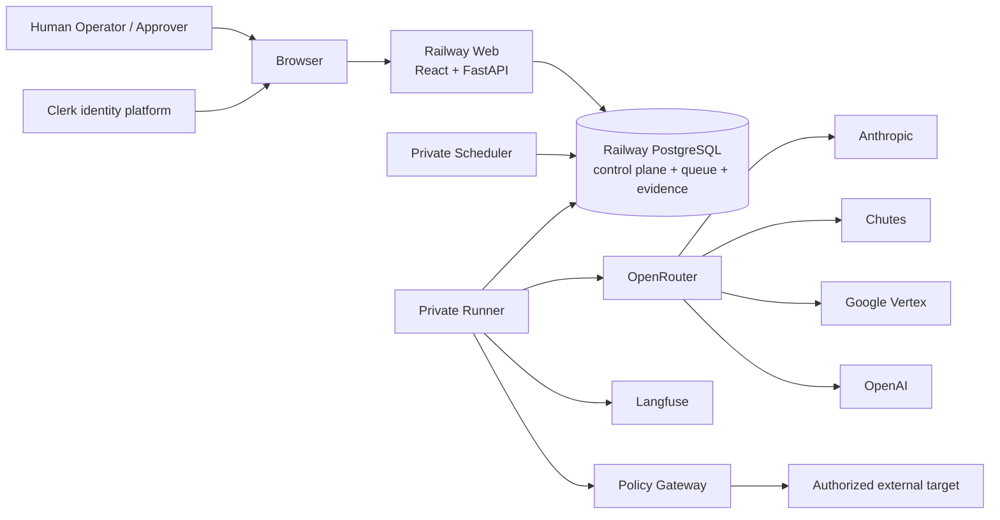
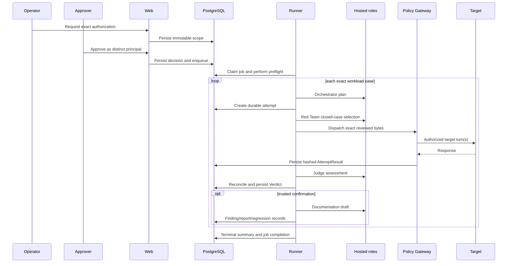

# ARCHITECTURE.md — AgentForge / Adversarial Machine

**Binding architecture, reconciled to code and read-only deployed state on 2026-07-26.**

**Requirements:** `Week_3_AgentForge.pdf`
**Current operations snapshot:** `docs/CURRENT_STATE.md`

## 1. Summary

AgentForge is a reusable multi-agent adversarial evaluation platform for continuously testing
AI-assisted clinical workflows. Its first target is the externally deployed OpenEMR Clinical
Co-Pilot. Target code is not part of this repository: the platform reaches a reviewed target only
through a versioned adapter and an exact allowlist. The Co-Pilot-specific threat model, workloads,
oracles, and vulnerability reports specialize the content; the execution, contracts, policy,
storage, and observability remain target-neutral.

The platform separates decision-making authority across four hosted roles and two deterministic
security components. The **Orchestrator** reads durable coverage, findings, and low-signal state to
plan each selection cycle. The **Red Team** is untrusted and, in the governed live replay path,
selects only a `case_ref` from an immutable reviewed workload; it cannot author the target-bound
bytes. The **Policy Gateway and Execution Recorder** are trusted deterministic components: only they
resolve a target-scoped credential, enforce authorization and caps, dispatch traffic, and persist the
hash-bound `AttemptResult`. The independent **Judge** sees bounded evidence, not target authority,
and its model assessment is reconciled in code with oracle/canary/human facts. The model cannot
confirm an exploit. The **Documentation** agent runs only after a trusted
`EXPLOIT_CONFIRMED` verdict and produces an unpublished draft plus regression-admission material.
This separation prevents an attacker model from judging itself, fabricating evidence, publishing a
finding, or obtaining a credential.

The implemented stack is Python 3.12, FastAPI, SQLAlchemy, psycopg, Alembic, PostgreSQL, React,
TypeScript, Vite, Clerk, OpenRouter, `httpx`, and Langfuse. Orchestration is a custom durable
PostgreSQL queue and concurrency-one Runner; LangGraph is not a dependency. PostgreSQL is the source
of truth for authorization, jobs, attempts, evidence, verdicts, findings, logical agent executions,
physical provider invocations/events, target HTTP requests, cost, and audit history. Langfuse is a
sanitized, fail-soft projection whose delivery is proven only by authenticated remote query-back.

Railway hosts one public Web service and private Runner, Scheduler, and PostgreSQL services. Web
serves the Clerk-backed same-origin console and protected `/api/v1`; Runner performs provider and
target work; Scheduler writes authorization-blocked replay plans on target-version changes. Human
authentication and application authorization are separate from live-campaign authority. A
different Clerk Approver must authorize an Operator's exact immutable scope, and the Runner rechecks
target, surface, workload, configuration, policy, credentials, synthetic provenance, caps,
authorization window, session lease, and heartbeat before any network call.

The current four hosted roles are Claude Opus 4.8, Qwen 3.5 397B, Gemini 2.5 Pro, and GPT-5.4 through
exact OpenRouter upstream routes with fallback disabled. Their prompt, configuration, generation
policy, token, timeout, retry, cost, rate, and concurrency authority are content-addressed. The
100-case/121-target-turn workload is split into exact 34/33/33-case sub-workloads.

The architecture is functional but not yet full-suite reliable. A 2026-07-26 staging campaign
completed 12 target attempts before a schema-invalid Gemini Judge response failed the batch. The
staged configuration authorized zero retries; structured-output failures are not retryable; terminal
batches cannot resume; and the Langfuse verifier rejects failed campaigns. These are current design
defects, not operator mistakes, and they define the remediation plan in `PLAN.md`.

## 2. System context



Trust boundaries:

- **Public:** Web HTTPS ingress and the minimal health/readiness/sign-in shell.
- **Human identity:** Clerk-issued session token verified by Web.
- **Private platform:** Runner, Scheduler, PostgreSQL, provider/target credentials.
- **Model providers:** untrusted external computation; every result is schema, identity, usage, and
  lineage checked.
- **Target:** external authorized system; responses are hostile/untrusted evidence until recorded and
  reconciled.
- **Observability:** Langfuse receives a sanitized projection and is never the source of authorization
  or verdict truth.

## 3. Deployed topology

All application services build the same Docker artifact:

| Service | Ingress | Process | Responsibility |
|---|---|---|---|
| Web | public HTTPS | `python -m agentforge.web` | console, protected API, commands, reads, health/readiness |
| Runner | private only | `python -m agentforge.runner` | queue claims, preflight, provider calls, target dispatch, evidence |
| Scheduler | private only | `python -m agentforge.scheduler` | target-version observation and replay-plan creation |
| PostgreSQL | private only | managed service | durable authority, evidence, queue, audit, read models |

Only Web runs `alembic upgrade head` as a Railway pre-deploy command. Runner and Scheduler refuse work
unless the database is at the exact packaged head. The current sole head is `0026`.

Staging currently has one policy-aligned service set. Production is reachable but release-skewed and
must not run campaigns until it is intentionally realigned. Dynamic deployment facts live in
`docs/CURRENT_STATE.md`, not this architecture.

## 4. Agent roles and trust

| Role | Model | Trust and authority | Input | Output |
|---|---|---|---|---|
| Orchestrator | `anthropic/claude-opus-4.8` | Trusted planner inside deterministic cost/coverage governor; no target credential | durable orchestration snapshot | bounded campaign decision |
| Red Team | `qwen/qwen3.5-397b-a17b` | Untrusted; governed live mode selects from a closed enum; cannot change target bytes, judge, publish, or hold credentials | exact reviewed candidates | selected `case_ref` and provider lineage |
| Judge | `google/gemini-2.5-pro` | Independent advisory evaluator; no mutation, target, publication, or remediation authority | bounded evidence envelope | advisory model state reconciled to a durable Verdict |
| Documentation | `openai/gpt-5.4` | Draft-only; invoked after trusted confirmation; no raw target credential or publication authority | sanitized finding/evidence references | unpublished vulnerability draft |

OpenRouter is one routing boundary, but the required upstreams are distinct and fallback is disabled:
Anthropic, Chutes, Google Vertex, and OpenAI in the current staging configuration. A returned model or
upstream mismatch fails closed.

The platform is multi-agent even though one case is processed in a controlled sequence: each role has
a separate prompt, model, configuration identity, provider invocation, durable execution row,
contract, context, parentage, and authority boundary.

## 5. Governed campaign lifecycle



### Authorization request and approval

Web derives the launcher identity from the verified Clerk principal. The request binds organization,
target/surface/version, workload and manifest digest, target credential reference/generation,
synthetic attestation/canaries, target caps, provider configuration/policy, expiry, and nonce. The
Approver identity is independently derived and must differ from the launcher.

### Runner preflight

Preflight is network-free and fails before provider or target I/O when any of these is invalid:

- database head or Runner readiness;
- target/surface/catalog state;
- authorization decision, expiry, or scope hash;
- exact workload identity, manifest order, provenance, and cap match;
- target credential binding and session lease covering the full run timeout;
- hosted configuration, prompt, generation-policy, model/upstream, and role-set identity;
- provider call/token/cost/retry/rate/concurrency capacity;
- synthetic fixture/canary provenance; or
- target execution profile and transport policy.

### Per-case execution

For exact live-100 workloads, the next manifest case is known before Red Team provider I/O. The
Runner creates the attempt first so the Red Team logical execution and every physical provider event
carry immutable attempt lineage from birth.

The Policy Gateway is the only target exit. It enforces logical/physical request counts, rate, budget,
timeout, target binding, adapter, and work-unit coordinates. A campaign-scoped HTTP client keeps the
versioned session stable. Session expiry aborts; there is no silent refresh or identity rotation.

### Terminalization

Every started agent/provider/target record must reach a terminal state. The current Runner completes a
job only after the campaign summary is durable. On any uncaught execution exception it marks the
campaign failed/aborted and the queue item non-retryable. This prevents unsafe blind replay but also
causes the current batch-level reliability defect described in Section 14.

## 6. Contracts and data lineage

Versioned JSON Schemas are packaged in `src/agentforge/contracts/v1/`. They cover:

- campaign directive and orchestration snapshot;
- attack attempt and attempt result;
- evidence envelope and verdict;
- vulnerability report;
- regression admission/disposition/replay;
- security-tool run, finding, bundle, and error; and
- the typed error taxonomy.

The schemas are framework-neutral and validated at runtime with `jsonschema`. Breaking changes require
a version bump, migration note, producer/consumer updates, and contract tests.

Core durable lineage:

```text
organization
  -> authorization request -> approval decision -> campaign run -> job
  -> campaign attempt -> target request(s) -> AttemptResult -> Verdict
  -> finding evidence -> Documentation execution -> report/regression records

campaign run
  -> logical agent execution
  -> physical provider invocation -> provider terminal event
```

`AttemptResult.content_hash` is the authoritative target-evidence identity. Provider usage and cost are
recorded per physical event and aggregated into the logical agent execution. Source workload
provenance added by migration `0025` records reviewed workload instance, review-record hash, and source
generation hash separately from security-tool provenance.

## 7. Human identity and authorization

Clerk is the managed human identity provider. The backend:

- accepts only an explicit bearer `session_token` for `/api/v1`;
- verifies RS256 networklessly with `CLERK_JWT_KEY`;
- checks exact non-wildcard authorized parties;
- requires the exact environment-specific Headshot Organization;
- authorizes only verified custom Organization permissions; and
- rejects impersonated, degraded, incomplete-task, wrong-organization, wrong-party, expired, or
  malformed sessions.

Roles organize permissions but do not replace permission checks:

- `org:operator`: read operations plus campaign launch/abort and target/config management.
- `org:approver`: read operations plus campaign authorization and finding approval/resolution.

Frontend controls are courtesy UX only. Server handlers derive identity and organization scope and
enforce object ownership plus the two-person invariant.

Authentication is never a target credential and never replaces Policy Gateway authorization.

## 8. Policy Gateway and target boundary

Target definitions and attack surfaces come from a trusted server-side catalog. Browser input cannot
create arbitrary hosts, adapters, methods, credentials, or endpoints.

The target specification binds:

- environment, base URL, allowlisted hosts, TLS and redirect policy;
- adapter and payload profile;
- target/surface versions and lifecycle;
- auth mode and opaque credential reference;
- ownership authorization;
- synthetic-data attestation and canary/oracle references;
- allowed methods/content types/response size/write resources; and
- logical/physical request, retry, rate, cost, and timeout caps.

The current live corpus is 100 cases/121 target turns split into three independently authorized
sub-workloads of 34/33/33 cases. Each batch has exact logical and physical caps and zero target
retries. This split is an authorization boundary, not an internal Runner chunking feature.

## 9. Judge design

The Judge consumes a bounded Evidence Envelope with explicit trust labels. Target and Red Team text is
hostile data; oracle/canary results, policy decision, expected-safe behavior, and evidence hashes are
code-produced trusted fields.

Verdict precedence:

1. deterministic oracle/canary/human confirmation can yield `EXPLOIT_CONFIRMED`;
2. the hosted Judge can yield advisory `EXPLOIT_LIKELY` or `NO_EXPLOIT_OBSERVED`;
3. code reconciles advisory output against deterministic evidence and calibration authority;
4. uncalibrated/ambiguous/missing evidence yields `INDETERMINATE` or `ERROR`; and
5. model output can never downgrade a trusted confirmation.

Calibration is bound to the exact Judge model, upstream, prompt, role configuration, generation
policy, implementation, corpus, and metrics. Passing measurements still require a genuine human
enablement decision. A calibration from another upstream identity is invalid.

Current staging has no enabled exact-identity calibration. Therefore the 11 latest non-oracle
verdicts are `INDETERMINATE`, not evidence of safety.

## 10. Hosted provider authority

The hosted configuration is an append-only, content-addressed PostgreSQL record. It binds exact
model IDs, upstream routes, prompt hashes, endpoint identity, credential references, prices, and role/
global limits. Campaign authorization embeds both configuration and generation-policy digests.

Current per-call generation policy:

| Role | Input | Output | Reasoning | Timeout |
|---|---:|---:|---:|---:|
| Orchestrator | 12,288 | 1,024 | 1,024 | 120 s |
| Red Team | 32,768 | 8,192 | 8,192 | 180 s |
| Judge | 32,768 | 512 | 1,024 | 180 s |
| Documentation | 12,288 | 512 | 1,024 | 120 s |

OpenRouter requests:

- send one immutable system prompt;
- require strict JSON Schema structured output;
- use exact `provider.only`;
- disable provider fallback and data collection;
- require supported parameters;
- set maximum prices and token/reasoning bounds;
- record provider request/model/upstream identity; and
- settle reported usage/cost against the durable ledger.

The transport can retry timeouts, transport errors, and HTTP 429/502/503 only within explicit
configuration authority. The current staged configuration sets `max_retries = 0`. A structured-output
validation failure is currently observed and terminal, not retryable.

## 11. Storage, queue, and migrations

PostgreSQL stores:

- target/surface definitions and lifecycle;
- authorization requests and decisions;
- campaign runs/events/attempts/work-unit reservations;
- agent configuration and hosted configuration sets;
- logical agent executions;
- physical provider invocations/events;
- outbound target HTTP requests;
- attempt results, verdicts, findings, decisions, reports, and regressions;
- jobs, leases, retries, dead letters, idempotency, and audit events; and
- read-model/coverage projections.

The queue uses transactional claims and leases with `SKIP LOCKED`. Runner concurrency is one per
process; provider concurrency is one in the current configuration. Command mutations use idempotency
keys.

Alembic applies an expand/contract history and rejects schema skew. The current sole head is `0026`;
Runner/Scheduler do not migrate.

## 12. Observability and Langfuse

PostgreSQL is authoritative. It records exact IDs, parentage, hashes, timestamps, durations, HTTP
status, provider identity, physical attempt sequence/status, tokens, measured provider cost, target
accounting, calibration state, verdict authority, and Langfuse delivery state.

The console reads organization-scoped PostgreSQL projections for Live, Agents, Traces, Costs,
Coverage, Resilience, Findings, Targets, Config, and Approvals. It does not receive Langfuse or
provider secrets.

Langfuse currently projects:

- a logical agent observation with a child cost-bearing generation; and
- target HTTP observations under the campaign/attempt lineage.

Payloads are sanitized to metadata, hashes, sizes, timing, usage, cost, and bounded status. Raw
credentials, real PHI, and unbounded hostile content are excluded.

SDK `flush()` leaves durable rows `queued`. Only authenticated exact remote query-back may set
`exported` and `langfuse_verified_at`.

Current gaps:

- the verifier accepts only completed campaign summaries;
- failed/aborted partial traces cannot be verified;
- physical provider attempts are durable but not separate Langfuse child observations;
- query-back is not an automatic durable reconciler; and
- a Runner crash loses in-memory projection handles.

## 13. Regression and scheduling

Confirmed exploits may enter the regression lifecycle only with trusted confirmation, reproducible
evidence, versioned case content, and admission checks. The Scheduler observes ready target versions
and writes an idempotent replay plan. The plan remains blocked on a new exact authorization and never
executes target traffic inline.

The current exact live-100 suite is a reviewed workload, not proof that all 100 cases completed.

## 14. Reliability and failure semantics

Implemented:

- network-free preflight;
- exact policy/configuration/corpus/cap validation;
- durable attempt-before-provider lineage;
- physical provider invocation/event ledger;
- campaign-scoped target client and lease;
- observed/unobserved provider outcome distinction;
- fail-closed model/upstream/usage/cost checks;
- target work-unit reservation; and
- sanitized failure-chain logging.

Open defects:

1. Schema-invalid provider output is not retryable.
2. Current staging authorizes zero provider retries.
3. One case-local Judge format error fails the whole batch.
4. Terminal/interrupted campaigns cannot resume from durable completed cases.
5. Queue failure is non-retryable even when a safe state-aware resume would be possible.
6. Failed campaigns cannot be Langfuse query-back verified.
7. The target HTTP transport label `succeeded` means a response was observed; HTTP 4xx still needs
   an application-level failure distinction in operator views.
8. The live singleton Orchestrator/Red Team selection path adds substantial latency/tokens while the
   manifest already fixes the next case.

These defects are binding inputs to `PLAN.md`. Documentation must not describe them as remediated
before code, tests, deployment, and acceptance evidence exist.

## 15. Security-tool integration

The platform includes governed catalog/normalization and evidence support for Garak, PyRIT, Giskard,
Promptfoo, Semgrep, ZAP, API discovery, authentication-matrix probes, OAST, and an HTTP workbench.

Tool output is candidate evidence, not target authority. A candidate must pass normalization,
synthetic/privacy validation, review, provenance hashing, workload admission, exact authorization,
and Policy Gateway enforcement before target dispatch. Subprocess/network egress is governed and no
tool receives broad ambient target credentials.

## 16. Performance and cost

The latest partial live run measured:

- 12 Orchestrator, 12 Red Team, and 12 Judge provider calls;
- 16 target turns;
- `$0.60731395` provider cost plus `$0.16` contracted target-call accounting;
- maximum Red Team latency 65.9 seconds; and
- approximately 72 seconds per completed case end to end.

At the current serial rate, one 34-case batch is roughly 41 minutes and the 100-case suite is roughly
two hours. The 180-second Red Team and Judge timeouts are therefore reliability requirements, not
excess envelope.

`docs/cost/COST_ANALYSIS.md` separates measured provider cost, contracted target accounting, Railway/
PostgreSQL/Langfuse operations, and future local/capacity inference. A per-suite baseline is only a
starting point; each 100/1K/10K/100K tier requires different scheduling, deterministic filtering,
capacity, storage, and observability design.

## 17. AI-use disclosure

| AI role | AI decision | Independent verification / human gate | Residual risk |
|---|---|---|---|
| Orchestrator | recommends next case/priority | deterministic allowed-workload, budget, low-signal, and halt policy | unnecessary/low-value calls; poor prioritization |
| Red Team | selects reviewed case; separate tooling generates candidates | closed enum; exact byte equality; review + new authorization for generated candidates | costly ceremonial selection; candidate-generation quality |
| Judge | advisory structured assessment | strict schema; deterministic oracle/canary precedence; exact calibration; human review | schema flakiness, false negatives, uncalibrated categories |
| Documentation | drafts report after confirmation | required fields, evidence references, data-quality checks, publication approval | misleading prose or remediation advice |

AI is deliberately not used for:

- target allowlisting and authorization;
- credential release;
- target/provider caps and usage settlement;
- evidence hashing and lineage constraints;
- launcher/approver separation;
- oracle/canary confirmation;
- migration/schema readiness; or
- Langfuse query-back equality.

The most important remaining AI risk is not prompt refusal; it is provider/model variability at the
strict structured-output boundary. The platform must contain that variability per case without
weakening authority or erasing evidence.

## 18. Known tradeoffs and non-goals

- One PostgreSQL instance per environment simplifies authoritative transactions but couples queue,
  evidence, and read-model availability.
- Concurrency one protects the target and simplifies caps but makes the current full suite slow.
- OpenRouter centralizes routing even though upstream providers are distinct.
- Networkless Clerk verification avoids a request-time IdP dependency but accepts still-valid signed
  claims until token expiry.
- The two-person gate sacrifices availability when only one authorized human is present.
- Target retries are zero for the exact live-100 suite to avoid duplicating stateful turns.
- Cryptographic cross-domain evidence signing and real HIPAA/BAA operation are out of scope; the
  platform is synthetic-data, ATO-style evidence.
- Full automatic remediation is out of scope. The platform drafts; humans approve publication and
  remediation.

## 19. Acceptance definition

The platform is full-suite operational only when:

- Web, Runner, and Scheduler share one GitHub/GitLab-green, dual-remote commit and policy artifact;
- PostgreSQL is at the packaged sole head;
- target-free four-role acceptance and Langfuse query-back pass;
- exact current-identity Judge calibration is human-enabled;
- a fresh two-person authorization covers the complete run and session lease;
- all three live-100 batches terminalize without repeating observed target turns;
- every case has a durable result and verdict, including explicit case-local errors;
- provider and target caps reconcile;
- complete/failed/aborted Langfuse traces remotely reconcile; and
- no critical finding is published or remediated without human approval.
