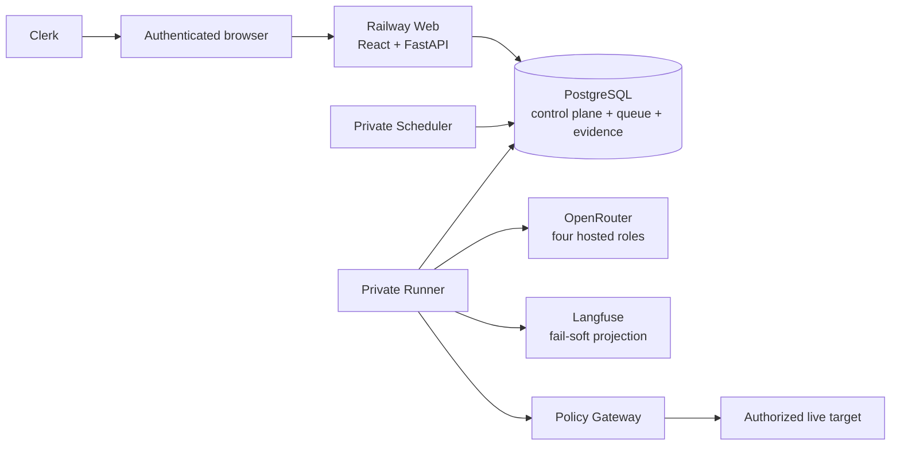
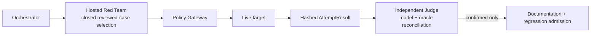

# AgentForge / Adversarial Machine

AgentForge is a reusable multi-agent platform for continuously red-teaming AI applications. Its first
target is the externally deployed OpenEMR Clinical Co-Pilot. The target is reached only over an
authorized live URL; target code does not live in this repository.

## Current status

As of 2026-07-26, the platform has:

- an authenticated React/Clerk operator console and protected FastAPI API;
- a PostgreSQL control plane, queue, audit/evidence store, and Alembic head `0026`;
- private Railway Runner and Scheduler services;
- exact-scope two-person campaign authorization;
- hosted Orchestrator, Red Team, Judge, and Documentation roles through OpenRouter;
- exact reviewed-workload target dispatch through the Policy Gateway;
- durable logical-agent and physical-provider lineage;
- independent deterministic Judge precedence; and
- PostgreSQL-authoritative telemetry with a fail-soft Langfuse projection.

It is **not yet full-suite reliable**. The latest staging campaign ran 12 of 34 cases, then a
schema-invalid Gemini Judge response failed the whole batch. The current staged configuration
authorizes zero provider retries, the Runner cannot resume a terminal batch, and failed campaigns
cannot be remotely query-back verified by the current Langfuse verifier.

Read [`docs/CURRENT_STATE.md`](docs/CURRENT_STATE.md) for exact deployment IDs, role models/upstreams,
caps, policy/configuration hashes, the latest run analysis, and open defects. Read
[`docs/DOCUMENTATION.md`](docs/DOCUMENTATION.md) before treating a dated review or planning file as
current.

## Live endpoints

| Endpoint | URL | Current status |
|---|---|---|
| Staging platform | `https://web-staging-8e30.up.railway.app` | `/health` 200, `/ready` 200, unauthenticated protected API 401; services share current policy digest |
| Production platform | `https://web-production-44528.up.railway.app` | reachable but release-skewed; do not launch campaigns |
| Authorized external target | `https://agent-production-9f62.up.railway.app` | live and healthy in read-only audit; active traffic still requires exact authorization |

The deployed URL is submitted with every checkpoint, but a healthy URL is not campaign acceptance.

## Safety invariants

- No real PHI. Fixtures, canaries, evidence, demonstrations, and documentation use synthetic data.
- Red Team, Judge, Orchestrator, and Documentation are distinct roles and trust contexts.
- The model Judge cannot confirm an exploit. Only an oracle, synthetic canary, or human can.
- A confirmed exploit cannot be downgraded to safe.
- Clerk authentication never authorizes target execution by itself.
- A launcher cannot approve their own operation.
- Only the Policy Gateway can release a target-scoped credential and send target traffic.
- Target, surface, version, workload, credential generation, caps, lease, policy, and hosted
  configuration are exact authorization-bound values.
- Critical publication and all remediation require human approval.
- Cost and usage come from durable measured facts; no placeholder is presented as measured.

## Architecture



Within a governed case:



PostgreSQL is the source of truth. Langfuse receives a sanitized projection and becomes delivery
evidence only after authenticated exact query-back.

See [`ARCHITECTURE.md`](ARCHITECTURE.md) for the binding architecture and AI-use disclosure.

## Current hosted roles

| Role | Model | Current staging upstream |
|---|---|---|
| Orchestrator | `anthropic/claude-opus-4.8` | Anthropic |
| Red Team | `qwen/qwen3.5-397b-a17b` | Chutes |
| Judge | `google/gemini-2.5-pro` | Google Vertex |
| Documentation | `openai/gpt-5.4` | OpenAI |

The live Red Team selects only from an immutable reviewed corpus. Novel/mutated candidate generation
is quarantined and cannot reach a target until human review, frozen provenance, a new workload digest,
and fresh authorization.

## Repository layout

| Path | Purpose |
|---|---|
| `src/agentforge/` | application package |
| `src/agentforge/agents/` | four agent roles, hosted policy/runtime, prompts |
| `src/agentforge/policy/` | allowlist, scoped credentials, Policy Gateway, recorder |
| `src/agentforge/campaign/` | authorization, workload resolution, coordinator |
| `src/agentforge/control_plane/` | durable control-plane store and records |
| `src/agentforge/providers/` | OpenRouter transport, usage ledger, physical lineage |
| `src/agentforge/telemetry/` | PostgreSQL/Langfuse projection |
| `src/agentforge/contracts/v1/` | packaged JSON Schema contracts |
| `evals/` | synthetic fixtures, reviewed workloads, calibration/evidence artifacts |
| `migrations/` | Alembic history; sole head is `0026` |
| `console/` | React/Vite operator console |
| `railway/` | Web/Runner/Scheduler service manifests |
| `docs/` | current runbooks plus dated evidence/history |

## Local development

Requirements:

- Python 3.12+
- Node `^20.19 || >=22.12`
- PostgreSQL 16

```bash
python3.12 -m venv .venv
source .venv/bin/activate
python -m pip install -e '.[dev]'
cp .env.example .env.local
docker compose up -d postgres
alembic upgrade head
cd console
npm ci --ignore-scripts
VITE_CLERK_PUBLISHABLE_KEY=pk_test_your_local_fixture npm run build
cd ..
python -m agentforge.web
```

`.env.local` is local-only. Never commit secrets or real clinical data. `/ready` returns 503 until
PostgreSQL is reachable at the exact packaged Alembic head, the console build exists, and Clerk/Web
security configuration parses.

### Local checks

```bash
ruff check .
ruff format --check .
pytest
cd console
npm run typecheck
npm test
npm run check:forbidden
npm run build
npm run check:bundle
```

Unit and integration tests use local fixture keys and controlled adapters. They must not contact
Clerk, Railway, Langfuse, a model provider, or the live target.

## Human access

The console uses Clerk invitation-only access, one exact Headshot Organization per environment, and
mandatory MFA. The backend authorizes only custom Organization permissions from verified session
claims.

| Role | Permissions |
|---|---|
| `org:operator` | console/findings/evidence/audit read; campaign launch/abort; target/config manage |
| `org:approver` | console/findings/evidence/audit read; campaign authorize; finding approve/resolve |

The backend enforces the full exact permission names documented in
[`docs/security/AUTHENTICATION.md`](docs/security/AUTHENTICATION.md). Frontend labels only improve UX.

Public routes are limited to:

- `GET /health`;
- `GET /ready`; and
- the static/sign-in/session-task application shell.

All `/api/v1` data and mutations default to protected. Missing or invalid authentication returns a
generic 401. An authenticated principal without the exact Organization/permission or distinct-person
condition receives 403. Broken verifier/security configuration fails closed.

## Campaign authorization

A live campaign requires:

1. authenticated Operator request;
2. immutable exact scope;
3. approval by a different authenticated Approver;
4. current Web/Runner/Scheduler release parity;
5. current Runner heartbeat;
6. ready allowlisted target/surface/version;
7. reviewed workload and synthetic fixture/canary provenance;
8. sealed target and provider credential references;
9. authorization and target-session lease coverage for the complete timeout;
10. exact model/configuration/generation-policy authority; and
11. target and provider call/token/cost/rate/retry/concurrency caps.

Failure denies the launch or aborts before unsafe continuation. A prior approval is not reusable after
a deployment or authority change.

## Documentation

Current:

- [Current state](docs/CURRENT_STATE.md)
- [Architecture](ARCHITECTURE.md)
- [Reliability plan](PLAN.md)
- [Railway runbook](docs/deployment/RAILWAY.md)
- [Authentication contract](docs/security/AUTHENTICATION.md)
- [Cost analysis](docs/cost/COST_ANALYSIS.md)
- [Threat model](THREAT_MODEL.md)
- [Users and workflows](USERS.md)

Historical/detailed evidence:

- [Requirements matrix](docs/requirements/REQUIREMENTS_MATRIX.md)
- [Red-team coverage review, 2026-07-25](docs/security/RED_TEAMING_COVERAGE_REVIEW_2026-07-25.md)
- [Langfuse review, 2026-07-24](docs/security/LANGFUSE_AGENT_OBSERVABILITY_REVIEW_2026-07-24.md)
- [Vulnerability reports](docs/vulnerabilities/README.md)

The historical files retain what was observed at their date. They do not override the current-state
snapshot.

## Release discipline

GitHub Actions and GitLab CI are both release gates. A release is valid only when:

- GitHub and GitLab CI are green on the exact commit;
- the same commit is present on `origin` and `gitlab`;
- Web, Runner, and Scheduler use the same artifact/policy;
- PostgreSQL is at the packaged sole Alembic head; and
- post-deploy target-free acceptance succeeds before fresh live authorization.

Deployment, Railway variable changes, credential rotation, and live campaigns are explicit human
operations. A code or documentation change does not authorize them.
