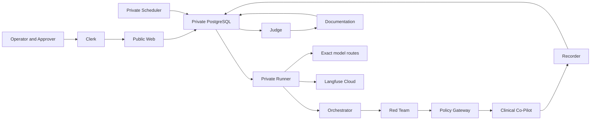

# THREAT_MODEL.md — OpenEMR target and Headshot platform

> **Evidence status — 2026-07-24.** This is a living, repository-grounded threat model, not a claim
> that every surface has been live-probed. The release candidate based on
> `ed41c6e20b7793c656c45aa6d05f8b9a0c476d1b` has one migration head at `0018`; the observed Railway
> release is still `23490ea` at migration `0013`. Candidate controls are therefore **implemented
> and tested**, not **live-verified**. The final authorized campaign, frozen 100-case evidence,
> Langfuse query-back, and real Clerk role/MFA workflow are unavailable or blocked as stated below.
> No real PHI is used or permitted.

## Executive summary (~500 words)

The target is a Clinical Co-Pilot embedded in OpenEMR for chart retrieval, summarization, intake, and
clinical operations. The canonical PRD describes clinical-record retrieval, possible write-back,
tools/functions, uploaded content, and multi-turn context. Those surfaces remain threat-model
assumptions until the reviewed target contract demonstrates them. Their combination is dangerous:
indirectly injected content could influence a write-capable tool. In a clinical setting, a wrong
answer may drive care and a data leak may expose PHI across patients.

**Highest-risk categories, in priority order.** (1) **Indirect and multi-turn prompt injection**,
because untrusted content and retained context can weaken safeguards. (2) **PHI exfiltration,
cross-patient exposure, and authorization bypass**, because retrieval plus a broken scope boundary
creates direct privacy harm. (3) **Tool misuse with write-back**, because unintended invocation or
parameter tampering can corrupt a record or trigger an action. (4) **State corruption/context
poisoning**, because conversation history is attacker-influenceable state. (5) **DoS and cost
amplification**, because recursive tools and long chains make runtime and spend unpredictable.
(6) **Identity/role exploitation**, because a multi-role co-pilot is a privilege-escalation surface.

**Coverage governance.** The Orchestrator reads persisted coverage, trends, findings, and regression
risk, then selects bounded Red Team work. Every reviewed case is tagged **boundary | invariant |
regression** and mapped to **OWASP Web Top 10 + OWASP LLM Top 10**. Generated variants cannot widen an
approved run: target dispatch stays byte-for-byte bound to the reviewed corpus, while changed
candidate bundles need a new hash and authorization. Regression admission requires reproduction and
"right reason" checks. The full adaptive loop and 100-case breadth are not yet live-evidenced.

**Known versus to-be-probed.** The reviewed adapter defines exact HTTPS `POST /chat` with
`session_id` in the body. Health and contract checks neither prove every PRD surface or defense nor
authorize traffic. Input/output guards, patient authorization, target rate limits, tool allowlists,
upload/RAG behavior, and write-back remain empirical questions for an authorized synthetic campaign.
The security owner's
[coverage review](docs/security/RED_TEAMING_COVERAGE_REVIEW_2026-07-24.md) governs its recorded
corpus/Judge assessment, and the owner-maintained
[vulnerability index](docs/vulnerabilities/README.md) is linked without re-scoring reports 004–006.
Later provider-binding and tracing code does not convert mapped coverage into live evidence.

**Judge and observability posture.** Deterministic code oracles have verdict precedence. The owner's
model-Judge calibration is not human-enabled and its identities differ from the final
`google-vertex/global` Judge and `atlas-cloud/fp8` Red Team routes. The model therefore remains
advisory/fail-closed; calibration does not block a deterministic-oracle-decided campaign, but a
model-only "safe" result has no authority. Candidate tracing creates one Langfuse AGENT per role and
one physical `provider.openrouter.attempt` GENERATION per model invocation without double-counting
logical usage. It passed local tests but is not deployed or queried back. PostgreSQL remains
authoritative.

**Release posture.** Only Railway Web is public; Runner, Scheduler, and PostgreSQL are private in the
observed topology. Production is blocked by the missing database backup/restore binding and human
deploy grant. Clerk is the human identity boundary for one Headshot Organization, but live
Operator/Approver acceptance is unverified and lower priority. Authentication never authorizes a
campaign: exact target, surface, allowlist, synthetic-data assertion, corpus, budget, rate, timeout,
abort, and distinct approval remain mandatory.

Risk below is qualitative likelihood × clinical/security impact, adjusted for implemented controls
and missing live evidence.

## Scope and assumptions

**In scope:** the external OpenEMR Clinical Co-Pilot surface described by the canonical PRD; Headshot
Web, Runner, Scheduler, PostgreSQL, four agent roles, Policy Gateway/Recorder, OpenRouter, Langfuse
Cloud, Railway deployment boundary, Clerk human identity boundary, and release/CI supply chain.

**Explicit deployment assumption:** this installation serves one Clerk Organization, **Headshot**.
It is not modeled as a multi-customer SaaS. Object and command queries still require the exact
Organization ID because wrong-environment and IDOR risks remain.

**Out of scope:** target source code (not in this repository), real PHI, other customer organizations,
Clerk/OpenRouter/Langfuse/Railway provider internals, and unauthorized active scanning. Test fixtures
and simulated findings are not treated as live target findings.

**Assumptions and open questions that affect risk:**

- Upload, RAG, write-back, tools, and role surfaces are PRD-described capabilities until the exact
  deployed target contract demonstrates each one.
- The target's patient/tenant authorization, input/output guards, and tool-side-effect controls remain
  to be probed under a separately authorized synthetic campaign.
- The frozen 100-case corpus and final security/performance evidence are not present in this candidate.
- Final staging must prove the candidate commit, migration `0018`, ordered role execution, exact
  provider routes, and Langfuse query-back; none is inferred from local tests.
- Live Clerk organization membership, custom permissions, MFA, and two-user separation remain
  unverified and cannot be cited as deployed controls.

## System model

### Primary components

| Component | Security role | Evidence anchor | Candidate/live status |
|---|---|---|---|
| Railway Web | Public console/API; verifies human identity and backend permissions; writes commands/read models | `src/agentforge/web.py`, `src/agentforge/auth/dependencies.py`, `src/agentforge/api/router.py` | Implemented/tested; older release live |
| PostgreSQL | Authoritative campaigns, queue, evidence, findings, accounting, lineage, and audit state | `src/agentforge/api/postgres.py`, `migrations/versions/` | Candidate head `0018`; deployed head `0013` |
| Scheduler and Runner | Private scheduling, job claim, role composition, target/model/trace egress | `src/agentforge/scheduler.py`, `src/agentforge/runner.py` | Implemented/tested; candidate behavior not live-verified |
| Four agents | Orchestrator, Red Team, Judge, Documentation with separate role records and authority | `src/agentforge/agents/`, `src/agentforge/contracts/v1/` | Implemented/tested; ordered hosted execution not live-verified |
| Policy Gateway and Recorder | Exact authorization enforcement, sole target dispatch, immutable evidence minting | `src/agentforge/policy/gateway.py`, `src/agentforge/policy/recorder.py` | Implemented/tested |
| Clerk | Human session issuer for the single Headshot Organization | `src/agentforge/auth/clerk.py`, `src/agentforge/auth/config.py` | Backend integration tested; real environment acceptance blocked |
| OpenRouter routes | Exact model/provider endpoints for four hosted roles | `src/agentforge/agents/hosted.py`, `src/agentforge/providers/openrouter.py` | Exact route validation tested; final calls not live-verified |
| Langfuse Cloud | Redacted observation projection; never evidence or authorization authority | `src/agentforge/telemetry/outbound.py`, `scripts/verify_langfuse_campaign.py` | Physical tracing tested; staging query-back unavailable |
| Clinical Co-Pilot | External live target reached only through the exact adapter and gateway | `src/agentforge/target/openemr_adapter.py`, `src/agentforge/target/catalog.py` | Prior target reachability exists; final campaign blocked |

### Data flows and trust boundaries

- **Browser → Clerk → Web:** Clerk session token and minimal identity claims cross HTTPS. Web
  verifies signature, explicit authorized party, exact Headshot Organization, and backend custom
  permissions. Live two-user/MFA acceptance is not yet evidence.
- **Web → PostgreSQL:** organization-scoped commands, idempotency keys, authorization requests, and
  decisions cross the private database channel. Stored launcher/approver identity and scope hash are
  server authority; client role labels are not.
- **PostgreSQL → private Runner:** immutable authorized scope and a leased job cross the queue
  boundary. Runner revalidates expiry, target, corpus hash, caps, secret references, and abort state
  before work.
- **Runner → OpenRouter:** a bounded hosted request crosses HTTPS only after exact
  model/provider/token-parameter configuration and credential reference resolution. Candidate routes
  are `amazon-bedrock/eu-west-1`, `atlas-cloud/fp8`, `google-vertex/global`, and `azure/eu`;
  fallback/substitution fails closed.
- **Red Team → Policy Gateway → target:** hostile proposed input crosses a typed contract, but only
  the gateway owns target egress and credentials. The sent input must remain byte-exact to the
  reviewed, hash-bound corpus; unreviewed model variants are quarantined rather than dispatched.
- **Target → Recorder → PostgreSQL → Judge:** hostile responses cross HTTPS into a trusted recorder.
  The Judge receives hash-verified typed evidence, and deterministic oracle/canary results override
  any model assessment.
- **Judge → Documentation → PostgreSQL:** only confirmed, sanitized evidence can produce a draft.
  Critical publication/remediation stays human-gated.
- **Runner → Langfuse Cloud:** safe IDs, hashes, order, exact model/provider, latency, token fields,
  retries/errors, and supplied cost cross HTTPS. Raw prompts/responses, credentials, and clinical
  bodies do not. Each physical provider call owns usage/cost; logical runtime children are
  metadata-only. PostgreSQL is authoritative until exact query-back succeeds.

#### Diagram

## OWASP taxonomy version (2021 anchor + 2025 crosswalk)

The **Web** `A0x` identifiers below are **OWASP Top 10:2021** — the set the PRD enumerates (it lists SSRF
as a standalone category, which exists only in 2021). **LLM** `LLM0x` identifiers are **OWASP LLM Top 10
(2025)**. Verified against owasp.org/Top10/2021 and owasp.org/Top10/2025 (2026-07-20). In the eval-case
schema each mapping is stored as a **structured tag `{framework, version, id, name}`** (e.g.
`{OWASP Web, 2021, A10, Server-Side Request Forgery}`), never a bare `A10` — because `A10` is *SSRF* in 2021
but *Mishandling of Exceptional Conditions* in 2025 (`DECISIONS.md` D15). **2021 → 2025 crosswalk** for the
categories used here: SSRF `A10:2021` → folded into `A01:2025` Broken Access Control · Injection `A03:2021`
→ `A05:2025` · `A08:2021` Software & Data Integrity Failures → `A08:2025` · `A07:2021` Identification & Auth
Failures → `A07:2025`. New in 2025 (forward-looking coverage candidates, not required by the PRD's 2021
anchor): `A03:2025` Software Supply Chain Failures, `A10:2025` Mishandling of Exceptional Conditions.

---

## Category 1 — Prompt Injection (direct · indirect · multi-turn)

- **Surface:** user chat input (direct); uploaded documents + RAG-retrieved record content (indirect);
  accumulated conversation context (multi-turn).
- **Impact:** the model executes attacker instructions — overriding safeguards, exfiltrating data, or
  triggering tools. Indirect injection is worst here because the payload rides in content a clinician
  legitimately uploaded or that RAG pulled from the record.
- **Exploit difficulty:** Low–Medium. The PRD already reports observed influence from uploaded content
  and multi-turn safeguard bypass.
- **Existing defenses:** *to-be-probed* (input sanitization? content/instruction separation?).
- **OWASP:** Web A03 Injection, A04 Insecure Design · LLM01 Prompt Injection, LLM04 Data/Model
  Poisoning (indirect via RAG/uploads).
- **Risk: Critical.**

## Category 2 — Data Exfiltration (PHI leakage · cross-patient · authorization bypass)

- **Surface:** RAG retrieval boundary; any response path that can echo retrieved records; the
  per-patient authorization check (if any).
- **Impact:** disclosure of PHI, or one patient's data surfacing in another's session — a direct
  regulatory and safety failure.
- **Exploit difficulty:** Medium. Depends on whether retrieval is scoped per authenticated
  patient/role or globally.
- **Existing defenses:** *to-be-probed* (row-level authz on retrieval? output PHI filtering?).
- **OWASP:** Web A01 Broken Access Control · LLM02 Sensitive Information Disclosure, LLM07 System
  Prompt Leakage, LLM08 Vector/Embedding Weaknesses (cross-tenant RAG bleed).
- **Risk: Critical.**

## Category 3 — State Corruption (conversation-history manipulation · context poisoning)

- **Surface:** persisted conversation state; any memory/summary the Co-Pilot carries forward; content
  written into the record that later re-enters context.
- **Impact:** an attacker seeds context so later, legitimate turns behave unsafely — a persistent,
  low-visibility compromise that survives across a session or is planted for a future user.
- **Exploit difficulty:** Medium. Requires understanding what the target persists.
- **Existing defenses:** *to-be-probed* (context trust separation? summary sanitization?).
- **OWASP:** Web A08 Software & Data Integrity Failures, A04 Insecure Design · LLM01 Prompt Injection,
  LLM04 Data/Model Poisoning.
- **Risk: High.**

## Category 4 — Tool Misuse (unintended invocation · parameter tampering · recursive calls)

- **Surface:** the tool/function-calling layer, especially any **write-back** tool (notes/orders) and
  any tool that takes free-form parameters.
- **Impact:** the highest-*action* category — corrupting the record, placing an unintended order, or
  driving recursive calls. Parameter tampering can redirect a legitimate tool to the wrong patient.
- **Exploit difficulty:** Medium–High (needs tool schema knowledge), but consequences are severe.
- **Existing defenses:** *to-be-probed* (tool allowlist? param validation? human confirm on write?).
- **OWASP:** Web A03 Injection, A01 Broken Access Control, A10 SSRF (if any tool fetches URLs) · LLM06
  Excessive Agency, LLM05 Improper Output Handling.
- **Risk: Critical.**

## Category 5 — Denial of Service (token exhaustion · infinite loops · cost amplification)

- **Surface:** unbounded generation, recursive tool chains, long multi-turn sessions, large uploads.
- **Impact:** cost blow-up and degraded availability — the PRD reports costs "increasing faster than
  expected" from recursive tool usage and long chains. In a clinical setting, unavailability is a
  safety issue.
- **Exploit difficulty:** Low–Medium.
- **Existing defenses:** *to-be-probed* (max tokens? loop/recursion caps? rate limits? upload caps?).
- **OWASP:** Web A04 Insecure Design · LLM10 Unbounded Consumption.
- **Risk: High.**

## Category 6 — Identity & Role Exploitation (privilege escalation · persona hijacking · trust-boundary violation)

- **Surface:** whatever distinguishes roles/permissions inside the Co-Pilot; any system-prompt-defined
  persona; the boundary between "user says" and "system authorizes."
- **Impact:** a lower-privileged user reaching higher-privileged data/actions, or the assistant being
  coerced into a persona that drops its safeguards.
- **Exploit difficulty:** Medium.
- **Existing defenses:** *to-be-probed* (role enforcement server-side vs prompt-only?).
- **OWASP:** Web A01 Broken Access Control, A07 Identification & Authentication Failures · LLM06
  Excessive Agency, LLM07 System Prompt Leakage.
- **Risk: High.**

## Platform identity boundary — Headshot console/API

This section models attacks against **AgentForge/Headshot itself**, not the external Co-Pilot. The
protected assets are target configuration, campaign controls, findings, hostile evidence, approval/audit
records, and event streams. The trust path is Browser → Clerk → public Railway Web → private Railway
services/Postgres. Clerk provides human identity; custom organization permissions provide application
RBAC; service identities and target-scoped credentials remain separate workload controls. The control
column states the required posture: backend verification and denial paths have source tests, while
Dashboard membership/MFA configuration, exact real-user permissions, and the final deployed
Operator/Approver workflow remain unverified.

| Platform identity threat | Abuse path and impact | Required control / failure behavior | OWASP Web Top 10:2021 |
|---|---|---|---|
| **1. Session-token theft** | A stolen bearer token lets an attacker act as a valid member until the token expires, exposing findings or campaign controls. | TLS; mandatory MFA for account access; short session lifetime; never persist a token in application storage unnecessarily; never log/token-trace it; revoke and investigate by immutable user/session ID. Sensitive operations still require custom permission and, where applicable, a different Approver. | **A07** Identification and Authentication Failures; **A02** Cryptographic Failures; **A09** Security Logging and Monitoring Failures |
| **2. XSS / token exposure** | Injected console content, especially hostile evidence, can execute in the Browser or leak a token through DOM, storage, telemetry, error reporting, or third-party scripts. | Escape/sanitize hostile content; strict CSP and dependency hygiene; never render raw evidence by default; no token in URL, Principal, error, log, trace, or client telemetry; keep frontend checks non-authoritative. | **A03** Injection; **A02** Cryptographic Failures |
| **3. Authorized-party misconfiguration** | A wildcard or incorrect `azp` allowlist lets a token minted for an unintended origin reach Headshot. | `CLERK_AUTHORIZED_PARTIES` is explicit per environment; wildcard rejected at config load; production entries require HTTPS; localhost allowed only locally; invalid config fails readiness and request-time failures return 503. | **A05** Security Misconfiguration; **A07** Identification and Authentication Failures |
| **4. Cross-origin / subdomain-cookie abuse** | An attacker-controlled origin or sibling subdomain induces authenticated requests, receives credentials, or abuses ambient cookies. | Exact CORS/authorized-party allowlists; secure cookie attributes where cookies are used; CSRF protection for ambient-cookie mutations; never trust all subdomains; no broad origin reflection; only the Web service is public. | **A01** Broken Access Control; **A05** Security Misconfiguration |
| **5. RBAC bypass** | Frontend role labels, Clerk system permissions, or client-supplied permission text are treated as authorization and unlock privileged actions. | Backend dependencies authorize only immutable custom organization permissions from the verified session claims. The role label is descriptive; client fields are ignored. Every handler defaults denied without its exact named permission. | **A01** Broken Access Control |
| **6. IDOR** | A permitted user changes a campaign, finding, evidence, target, or approval identifier to access a different object outside the authorized operation. | Permission checks are necessary but not sufficient: scope every lookup and mutation to the authorized organization/resource relationship; use server-derived identity; return non-enumerating denial; audit object and Principal IDs. | **A01** Broken Access Control |
| **7. Organization confusion** | A valid Clerk session with no organization, the wrong organization, or a production organization reused in staging is accepted. | Require the exact environment-specific `CLERK_REQUIRED_ORG_ID`; deny missing/wrong org with 403; personal accounts and user-created orgs disabled; staging config containing the production org ID fails load/readiness. | **A01** Broken Access Control; **A04** Insecure Design |
| **8. Approval identity spoofing** | The launcher supplies an approver ID, changes a role label, or replays their own session to satisfy a two-person gate. | Derive both identities only from verified immutable Principals and server-side workflow state; require `org:campaign:authorize`/`org:findings:approve`; enforce `approver.user_id != launcher_user_id`; bind action nonce; audit both user/session IDs. No solo/break-glass bypass. | **A01** Broken Access Control; **A07** Identification and Authentication Failures; **A04** Insecure Design |
| **9. Stale/revoked permission behavior** | A user removed from a role or organization continues using a still-valid signed session claim during its remaining lifetime. | Use short session lifetime and re-authentication for high-risk actions; revoke sessions and monitor audit events. **Residual:** networkless JWT verification deliberately accepts a valid signed claim until expiry, so permission revocation is not instantaneous. Never claim otherwise. | **A01** Broken Access Control; **A07** Identification and Authentication Failures |
| **10. Event-stream leakage** | An unauthenticated or under-authorized SSE/WebSocket subscriber receives findings, traces, costs, or hostile evidence; a token in a query string leaks via logs/referrers. | Authenticate and authorize before opening each stream; require the corresponding read permission and object scope; never place tokens in URLs; close/revalidate at token expiry; sanitize payloads; event routes are excluded from the public allowlist. | **A01** Broken Access Control; **A02** Cryptographic Failures; **A09** Security Logging and Monitoring Failures |
| **11. Authentication outage / fail-open** | Clerk, verifier, key, or configuration failure causes the service to bypass authentication so work can continue. | Networkless verification keeps valid signed sessions independent of a Clerk/JWKS request. Invalid config blocks readiness; unexpected verifier/SDK/config failure returns generic 503; no cached raw claim, frontend decision, anonymous fallback, or dynamic JWKS escape hatch is accepted. | **A04** Insecure Design; **A05** Security Misconfiguration; **A07** Identification and Authentication Failures |

**Priority.** RBAC/IDOR/organization confusion and approval spoofing are Critical because they can permit
live operations or expose hostile evidence; session/XSS/event-stream leakage is High because it can steal
the same authority; configuration, freshness, and outage behavior are High because a single fail-open
mistake collapses every route-level control. Authentication still does not authorize an attack: after
Clerk identity/RBAC and distinct-Approver checks, the Policy Gateway must independently enforce exact
target authorization, allowlist, scoped credentials, synthetic data, budget/rate, monitoring, and abort.

---

## Assets and security objectives

| Asset | Why it matters | Security objective |
|---|---|---|
| Target/provider/Clerk/Langfuse credentials | Theft enables unauthorized target traffic, model spend, impersonation, or observation access | Confidentiality, integrity |
| Campaign authorization envelope | It is the legal/technical boundary on which target, corpus, rate, budget, timeout, and abort were approved | Integrity |
| Synthetic corpus and fixture provenance | Corpus drift or real PHI invalidates authorization and evidence | Confidentiality, integrity |
| Recorder evidence and oracle fields | Findings and regressions are only defensible if target outcomes cannot be forged or downgraded | Integrity, availability |
| Human approvals and audit events | They establish separation of duties and accountability | Integrity, non-repudiation |
| Queue, leases, and physical reservations | Ambiguity can cause duplicate external side effects or hidden omissions | Integrity, availability |
| Provider lineage and cost accounting | Model substitution, missing retries, or double counting corrupts security and cost conclusions | Integrity |
| Release commit, migration head, and deployment binding | Source/deployment drift makes every acceptance claim non-reproducible | Integrity, availability |
| Hostile findings and reports | They may contain exploit material and injection payloads | Confidentiality, integrity |
| Headshot and target availability | Unbounded campaigns can disrupt the evaluation platform or a clinical dependency | Availability |

## Attacker model

### Capabilities

- An unauthenticated internet user can reach Railway Web and its public liveness/readiness and
  authentication shell.
- A phished or malicious Headshot member may possess a valid Clerk session but lack a required custom
  permission or a distinct approver.
- An authorized operator can submit campaign/configuration input and intentionally hostile payloads,
  but cannot legitimately expand an already approved scope.
- Target and model responses are attacker-controlled/untrusted data and may attempt prompt injection
  against Judge, Documentation, logs, or the browser.
- External providers, dependencies, or release automation may return substituted metadata, fail,
  throttle, or be compromised.
- A network or process failure can occur between an irreversible external send and durable
  observation, creating retry ambiguity.

### Non-capabilities

- A remote attacker is not assumed to have Railway project administration, PostgreSQL owner access,
  Clerk dashboard administration, or the private Runner network.
- A Red Team or Judge model is not assumed to hold target credentials, publish authority, or direct
  database-owner privileges.
- Other customer organizations and cross-customer tenancy are out of scope; this is a single
  Headshot-organization deployment.
- No actor is authorized to use real PHI or to actively scan an origin without its own exact,
  persisted authorization.

## Entry points and attack surfaces

| Surface | How reached | Trust boundary | Notes | Evidence |
|---|---|---|---|---|
| Public health/auth shell and default-deny Web routing | Internet HTTPS | Internet → Web | Only liveness/readiness and minimum sign-in shell may be public; API is protected | `src/agentforge/web.py` |
| Clerk bearer verification | Authorization header | Browser/Clerk → Web | Exact authorized party, environment, organization, and custom permissions | `src/agentforge/auth/config.py`, `src/agentforge/auth/dependencies.py` |
| `/api/v1` commands and projections | Authenticated HTTPS | Human → control plane | Organization/resource scope and idempotency required | `src/agentforge/api/router.py`, `src/agentforge/api/postgres.py` |
| Campaign authorization and queue claim | PostgreSQL private channel | Web/Scheduler → DB → Runner | Exact scope hash, distinct human, expiry, nonce, caps, leases | `src/agentforge/campaign/authorization.py`, `src/agentforge/campaign/coordinator.py` |
| Hosted role prompts and provider responses | Runner outbound HTTPS | Private Runner → OpenRouter/providers | Exact model/route and fail-closed metadata; responses remain untrusted | `src/agentforge/agents/hosted.py`, `src/agentforge/providers/openrouter.py` |
| Target adapter | Gateway outbound HTTPS | Private Runner → Clinical Co-Pilot | Sole target egress; byte-exact corpus and scoped credential | `src/agentforge/policy/gateway.py`, `src/agentforge/target/openemr_adapter.py` |
| Evidence/Judge/Documentation handoffs | Typed records | Untrusted content → governed evaluation | Hash verification, deterministic precedence, sanitized drafts | `src/agentforge/agents/judge/envelope.py`, `src/agentforge/agents/documentation/agent.py` |
| Langfuse export/query-back | Runner outbound HTTPS | Authoritative DB → external observer | Safe metadata only; exact remote reconciliation before exported | `src/agentforge/telemetry/outbound.py`, `scripts/verify_langfuse_campaign.py` |
| CI, migrations, and Railway promotion | GitHub and operator tooling | Developer/build → runtime | Same commit on both remotes; one migration head; production human/rollback gates | `.github/workflows/ci.yml`, `railway/`, `migrations/versions/` |

## Top abuse paths

1. **Exfiltrate clinical data:** inject direct/indirect instructions → influence retrieval or output
   → cross patient/role boundary → disclose sensitive data.
2. **Cause an unsafe target action:** induce tool selection → tamper patient/action parameters →
   exploit missing target-side authorization → corrupt a record or trigger an unintended action.
3. **Launch outside approved scope:** steal or misuse a valid session → obtain/forge an approval →
   alter target, corpus, budget, or expiry → send unauthorized traffic. Exact scope hashing and
   gateway revalidation are intended to stop the last step.
4. **Turn generation into authority:** compromise or inject the Red Team model → emit an unreviewed
   variant → attempt direct dispatch. The model has no credential/adapter and the candidate must be
   quarantined; any byte drift requires a new corpus and approval.
5. **Downgrade a confirmed exploit:** place instructions in a target transcript → manipulate the
   model Judge → return "safe." Typed code-oracle fields take precedence, so model disagreement
   cannot reverse a conclusive exploit.
6. **Poison evidence or the console:** return hostile markup/links → persist it as evidence → render
   it unsafely or leak it to telemetry. Quarantine, hashes, sanitization, CSP/encoding, and no raw
   Langfuse bodies limit this path; deployed browser acceptance remains unavailable.
7. **Hide or multiply physical calls:** trigger provider retries or crash after an external send →
   lose lineage → undercount cost or replay an ambiguous request. Migration `0018` provides physical
   provider lineage; work-unit reservations prohibit blind target replay.
8. **Promote an unproven release:** rely on local tests/old deployment → call the candidate live →
   publish results without exact CI/deployment/migration/Langfuse binding. Release evidence must bind
   one SHA and remain blocked until staging acceptance.
9. **Make rollback destructive:** promote production without a database recovery point → migration or
   release failure → no compatible restore path. This is the current production hard blocker.

## Threat model table

| Threat ID | Threat source | Prerequisites | Threat action | Impact | Impacted assets | Existing controls and evidence | Gaps | Recommended mitigations | Detection ideas | Likelihood | Impact severity | Priority |
|---|---|---|---|---|---|---|---|---|---|---|---|---|
| TM-001 | Target user or poisoned content | Target accepts chat, upload, retrieval, or multi-turn input | Override instruction hierarchy through direct/indirect injection | Unsafe response, data disclosure, or tool activation | Target data/actions, clinical trust | Typed corpus; gateway-only dispatch; target responses untrusted (`evals/`, `src/agentforge/policy/gateway.py`) | Upload/RAG surfaces and defenses not yet live-probed; no frozen 100 evidence | Authorize category-specific synthetic cases and instrument retrieval/tool boundaries | Oracle hits, policy refusals, category coverage by executable/live/decisive state | High | High | critical |
| TM-002 | Authenticated or injected target user | Retrieval/output boundary lacks patient/role scope | Coax or cause cross-patient/PHI disclosure | Privacy, regulatory, and clinical harm | Clinical data, trust | Synthetic-only gate; canary/oracle precedence; scoped evidence (`src/agentforge/agents/judge/oracles/`) | Target-side row/scope controls unobserved | Add patient/tenant retrieval traces and semantic/encoded leakage detectors with reviewed labels | Cross-scope IDs, PII canaries, unexpected retrieval sources | Medium | High | critical |
| TM-003 | Target user or persisted hostile content | Conversation/record content is reused | Poison state so later turns act on attacker context | Persistent unsafe behavior and hard-to-reproduce drift | Conversation state, evidence integrity | Run/corpus hashes, immutable attempt identity, deterministic replay contracts | Target persistence behavior unobserved | Instrument pre/post state and context-source lineage; reset/isolate synthetic sessions | State diffs and cross-turn behavior changes | Medium | High | high |
| TM-004 | Injected model output | Target exposes write/fetch/tool capability | Select unintended tool or tamper arguments/recipient | Record corruption, unintended order, SSRF, recursive calls | Target actions, availability | Policy Gateway caps/allowlist; Judge typed oracle fields (`src/agentforge/policy/`, `src/agentforge/agents/judge/`) | Target tool schema and side-effect telemetry unobserved | Capture trusted tool name/args/auth decision/pre-post state; require target-side authorization | Forbidden tool/arg oracle, write audit, recursion/cost alerts | Medium | High | critical |
| TM-005 | Internet user, operator, or model response | Limits or queues are bypassed | Exhaust tokens, retries, concurrency, DB/queue, or target capacity | Cost spike and service/clinical dependency degradation | Availability, budget | Budget/rate/logical/physical/retry/timeout caps; queue leases; candidate source admits exactly 400 zero-retry hosted calls (`src/agentforge/campaign/caps.py`, `src/agentforge/storage/queue.py`, `src/agentforge/platform_limits.py`) | No exact 100-case configuration or authorized live evidence is deployed; one retry across all four roles would require 800 calls and is correctly refused | Bind zero provider retries plus exact frozen-workload token/USD/time ceilings, prove them under bounded load, and alert on burn rate, queue age, and low-signal streak | Rate/timeout/cost/queue-depth alerts | Medium | High | high |
| TM-006 | Stolen session or malicious member | Valid Clerk token but missing scope/permission/separation | Bypass org/RBAC/IDOR/two-person checks | Unauthorized configuration, evidence access, or launch | Human authority, target scope, findings | Networkless JWT verification, exact organization/custom permission, DB distinct-person trigger (`src/agentforge/auth/`, migration `0012`) | Real Headshot membership/MFA/two-user flow not accepted | Complete staging Clerk acceptance without weakening campaign gate | 401/403/503 metrics, wrong-org and self-approval audit events | Medium | High | high |
| TM-007 | Authorized human or compromised Web | Ability to submit a run request | Reuse approval after changing target/corpus/caps/expiry/credential | Off-scope attack and uncontrolled spend | Authorization envelope, credentials | Content-addressed operation hash and per-send revalidation (`src/agentforge/campaign/authorization.py`, `src/agentforge/policy/gateway.py`) | Final deployed negative drills unavailable | Run altered-field denial matrix on exact staging release | Zero-send denials joined to scope hash and principal | Low | High | high |
| TM-008 | Compromised Red Team/provider | Hosted generation is enabled | Emit malicious/unreviewed variant or falsify provider identity | Scope expansion, harmful content, evidence confusion | Corpus, provider lineage | No target credential; exact route/fallback disabled; byte-exact approved dispatch (`src/agentforge/agents/hosted.py`, `src/agentforge/providers/openrouter.py`) | Final hosted Red Team and route identity not live-verified | Quarantine generated variants; review/hash/re-authorize before target use | Variant hash mismatch, route substitution, provider metadata mismatch | Medium | High | high |
| TM-009 | Target transcript or compromised Judge/provider | Model Judge receives hostile evidence | Instruct Judge to suppress a confirmed exploit or overstate safety | False negative and unsafe regression admission | Verdicts, findings, regression suite | Typed envelope; deterministic-oracle precedence; model advisory on identity drift (`src/agentforge/agents/judge/`) | Final identity-bound calibration/human enablement absent | Keep model non-decisive; recalibrate exact runtime identity and require explicit enablement | Oracle/model disagreement, abstention, calibration drift | Medium | High | high |
| TM-010 | XSS, log sink, telemetry operator, or secret leak | Hostile body/credential reaches UI, logs, DB, or Langfuse | Exfiltrate token/key/evidence or execute browser content | Credential theft and authority compromise | Credentials, hostile evidence, audit data | Secret references/redaction; no raw Langfuse bodies; sanitized documentation (`src/agentforge/secrets.py`, `src/agentforge/telemetry/outbound.py`) | Final bundle/browser/query-back inspection unavailable | Verify CSP/escaping and trace payload allowlist on staged build; rotate on exposure | Secret scan, CSP reports, redaction tests, trace-field diff | Medium | High | high |
| TM-011 | Dependency, CI, or release operator | Mutable dependency/action/image or mismatched refs | Ship unreviewed code/model route/schema | Supply-chain compromise or unverifiable evidence | Release artifact, migration, credentials | GitHub authoritative CI; dual remote SHA law; one Alembic head; scanner gates | Python resolution/base images/actions not fully digest-pinned; final CI/deploy absent | Hash-lock Python graph, pin actions/images, sign immutable image, compare GitHub/GitLab/Railway SHA | SBOM/digest diff, remote-ref and migration identity checks | Medium | High | high |
| TM-012 | Process/database/deployment failure | External side effect or migration occurs without recovery binding | Replay ambiguous request or promote without recoverable DB | Duplicate target effects, evidence loss, extended outage | Evidence, queue, database, availability | Pre-send reservations, append-only ledger, expand/contract rollback procedure (migrations `0014`, `0018`; ATO rollback runbook) | Production has no confirmed DB backup/restore binding and no human grant | Configure/test backup restore; bind compatible rollback image and DB point before promotion | Stale reservation, lease expiry, migration mismatch, backup-age/restore alerts | Medium | High | high |

## Criticality calibration

- **Critical:** plausible path to cross-patient disclosure, unauthorized clinical action, or an
  off-scope live attack with severe safety/legal impact. Examples: decisive PHI exfiltration,
  write-capable tool misuse, or campaign authorization bypass.
- **High:** compromises verdict/evidence/release integrity, credentials, or availability but still
  encounters an independent control or requires privileged access. Examples: model-Judge injection
  while oracle precedence holds, provider substitution caught by exact metadata, or production
  rollback without a DB recovery point.
- **Medium:** bounded data/availability loss with limited reach and straightforward containment.
  Examples: fixed-window UI enumeration, delayed Langfuse query-back while PostgreSQL remains
  authoritative, or noisy queue pressure below hard caps.
- **Low:** defense-in-depth weakness with no demonstrated sensitive impact. Examples: low-sensitivity
  version disclosure or cosmetic observability drift that cannot change authority/evidence.

The rankings assume one Headshot Organization, private Runner/Scheduler/PostgreSQL, synthetic-only
campaigns, and deterministic-oracle precedence. Multi-customer tenancy, real PHI, a public Runner, or
model-only decisive verdicts would raise several priorities.

## Focus paths for security review

| Path | Why it matters | Related threats |
|---|---|---|
| `src/agentforge/auth/` | Human token reduction, exact org, authorized parties, and custom permissions | TM-006, TM-010 |
| `src/agentforge/api/router.py` | Public API permission and command boundary | TM-006, TM-007 |
| `src/agentforge/campaign/` | Immutable authorization, corpus, cap, nonce, and queue binding | TM-005, TM-007, TM-008 |
| `src/agentforge/policy/` | Sole target dispatch, credential release, caps, and evidence recording | TM-001, TM-002, TM-004, TM-007 |
| `src/agentforge/target/` | Exact external origin, adapter semantics, and response normalization | TM-001–TM-005 |
| `src/agentforge/agents/judge/` | Oracle precedence, envelope integrity, calibration, and model authority | TM-002, TM-004, TM-009 |
| `src/agentforge/agents/hosted.py` | Exact four-role model/provider/token configuration | TM-008, TM-011 |
| `src/agentforge/providers/openrouter.py` | Physical request retries, route identity, usage, cost, and error handling | TM-005, TM-008, TM-011 |
| `src/agentforge/telemetry/outbound.py` | Redaction, physical generation hierarchy, delivery, and query-back state | TM-010, TM-012 |
| `src/agentforge/api/postgres.py` and `migrations/versions/` | Authoritative state, grants, constraints, lineage, and migration safety | TM-006–TM-012 |
| `console/src/` | Hostile evidence rendering and non-authoritative UI controls | TM-006, TM-010 |
| `.github/workflows/ci.yml`, `Dockerfile`, `railway/` | Release supply chain and public/private deployment boundary | TM-011, TM-012 |

## Quality check

- Target and platform entry points are covered; PRD-described but unobserved target surfaces are
  labeled assumptions.
- Every trust boundary appears in at least one abuse path and threat.
- Runtime, external providers, CI/release, tests, and historical evidence are distinguished.
- The unresolved user-context question is explicit: single Headshot Organization is assumed, not
  multi-customer tenancy.
- Missing Clerk acceptance, frozen 100 evidence, staged Langfuse reconciliation, final CI/deploy, and
  production database rollback binding remain visible blockers.

## Target coverage priority (feeds the Orchestrator)

`1 Prompt Injection (Critical)` → `2 Data Exfiltration (Critical)` → `4 Tool Misuse (Critical)` →
`3 State Corruption (High)` → `5 DoS/Cost (High)` → `6 Identity/Role (High)`. Priority is
the intended policy. The current Runner/corpus does not yet demonstrate this full adaptive loop; use the
security owner's coverage review for actual status.
