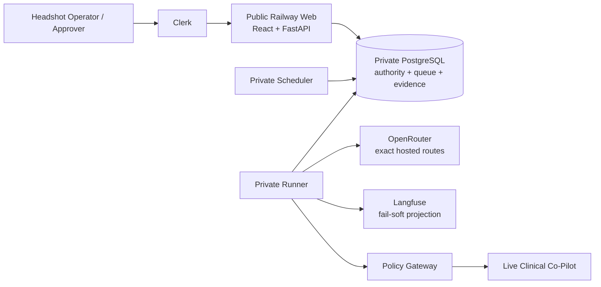

# AgentForge architecture defense

**Updated:** 2026-07-27

**Canonical requirements:** [`../../Week_3_AgentForge.pdf`](../../Week_3_AgentForge.pdf)

**Exact state:** [`../CURRENT_STATE.md`](../CURRENT_STATE.md)

This is the current defense briefing. Historical research and original decisions remain under
`docs/planning/` and ADR-0001; ADR-0004 records the implemented runtime decision.

## Thirty-second thesis

AgentForge is a reusable multi-agent adversarial evaluation platform, not target-specific scripts. It
attacks an externally deployed Clinical Co-Pilot only through a governed live URL. Clerk controls
human access; exact two-person authorization controls campaign intent; a private Runner applies
provider and target caps; PostgreSQL preserves evidence and recovery truth; an independent Judge
cannot override a confirmed exploit; and Langfuse receives a sanitized, fail-soft projection.

## What is actually deployed

- Python 3.12, FastAPI, Uvicorn, SQLAlchemy 2, psycopg 3, Alembic.
- React 18, TypeScript 5.9, Vite 7, Clerk.
- One Docker artifact for Web, Runner, and Scheduler.
- PostgreSQL durable queue with leases/`SKIP LOCKED`; no LangGraph dependency.
- Deployed staging PostgreSQL is at sole Alembic head `0025`; the repository candidate packages sole
  head `0026` and is not deployed.
- OpenRouter exact routes with fallback disabled.
- Langfuse 4.14.1 as an external projection; PostgreSQL is authoritative.
- Staging is release-aligned; production is currently release-skewed and blocked for campaigns.

## Why this is multi-agent

| Role | Current model | Independent responsibility |
|---|---|---|
| Orchestrator | Claude Opus 4.8 | bounded planning/prioritization |
| Red Team | Qwen3.5 397B A17B | exact approved-corpus selection; untrusted |
| Judge | Gemini 2.5 Pro | independent advisory evidence assessment |
| Documentation | GPT-5.4 | draft-only report after trusted confirmation |

Separation is not a diagram claim. Every role has its own prompt digest, model/upstream route,
configuration identity, schema, context, logical execution, physical invocation, telemetry, and
authority boundary. Red Team cannot judge or publish; Judge cannot mutate attacks or confirm an
exploit without deterministic/human authority; Documentation cannot publish.

The live selector cannot inject arbitrary model output into the target. Novel generation follows
generation → quarantine → review → immutable workload → fresh authorization.

## Why custom orchestration

The platform must bind authorization, database leases, work-unit order, target side effects, physical
provider billing, and evidence hashes. A generic graph checkpoint would not establish whether a target
turn happened exactly once. The custom Runner makes those state transitions explicit in PostgreSQL.
This buys precise governance and lineage at the cost of owning retry/resume correctness; `PLAN.md`
tracks the remaining work.

## Authorization and failure safety

A live request binds:

- exact Clerk organization and distinct launcher/approver identities;
- target, surface, version, adapter, and credential generation;
- synthetic-data attestation and canaries;
- workload/manifest/provenance hashes;
- logical cases, physical target turns, target retries/rate/timeout/spend;
- hosted role set, upstreams, prompt/policy/configuration digests;
- provider calls/tokens/retries/rate/concurrency/spend; and
- expiry/lease long enough for the run.

Preflight fails before provider or target I/O on a mismatch. A release restart invalidates stale
heartbeats and any authorization whose bound policy/config no longer resolves. Clerk authentication
never releases a target credential.

## Judge invariant

The target and Red Team are hostile evidence sources. Trusted oracle/canary/human facts outrank the
model. A model may advise likely/no observed exploit; it cannot downgrade trusted confirmation.

The current staging Judge identity lacks enabled exact calibration. Its 11 successful latest-run
decisions therefore terminalized `INDETERMINATE`. That is honest uncertainty, not proof of safety.

## Evidence and observability

PostgreSQL records:

- authorization and approval;
- campaign/job/work-unit state;
- attempts and target calls;
- content hashes and attempt results;
- logical agent executions;
- physical provider invocations/events, usage, cost, model/upstream, and status;
- verdicts, findings, drafts, and audit events; and
- Langfuse delivery state.

Langfuse is useful for trace exploration but cannot authorize, adjudicate, or repair a campaign.
Delivery is proved only by authenticated exact query-back. The latest failed campaign exposed a real
gap: 36 agent and 16 target projections remain queued, and the verifier rejects non-completed runs.

## Measured latest-run evidence

Release `456d6e5` ran 12 of 34 cases:

- 12 attempts/results;
- 36 provider calls;
- 16 target calls, including one HTTP `422`;
- 11 `INDETERMINATE` verdicts;
- `$0.60731395` measured provider cost; and
- no lineage-binding conflict.

The maximum Red Team call took 65.9 seconds, proving the 180-second timeout is necessary. The batch
failed on one HTTP-`200`, schema-invalid Judge response because retries were configured to zero and one
attempt exception aborted the batch.

## Honest gaps and remediation

1. Retry schema-invalid Judge output once within explicit physical-call/token/cost authority.
2. Convert exhausted eligible provider-format failures into case-local `ERROR`, not campaign abort.
3. Resume without replaying known target side effects.
4. Project/query-back complete, failed, and aborted traces, including physical provider attempts.
5. Calibrate the exact current Judge model/upstream/prompt/policy identity.
6. Remove ceremonial per-case hosted work that cannot affect exact manifest dispatch.
7. Realign production from one reviewed release and capture genuine signed-in Clerk acceptance.

The platform is implemented and has meaningful live evidence, but the full 34-case shard and 100-case
suite have not completed. That statement is part of the defense, not a footnote.

## Build versus configure

- **Built:** governed Orchestrator/Red Team/Judge/Documentation roles, Policy Gateway, durable queue,
  evidence lineage, contracts, calibration gates, console, and campaign lifecycle.
- **Configured/wrapped:** Clerk, Railway, PostgreSQL, OpenRouter/upstreams, Langfuse, ZAP, Semgrep,
  Garak, PyRIT, Giskard, and Promptfoo.
- **Rejected:** commercial red-team platforms as the product, Redis/Celery as an unnecessary second
  state plane, browser-held secrets, arbitrary target URLs, model fallback, and target code inside this
  repository.

## AI-use disclosure

AI coding agents assisted with research, implementation, tests, audits, and documentation. No agent
was treated as deployment, campaign, approval, or publication authority. Requirements, code,
migrations, test results, read-only deployed-state checks, and human-gated external actions remain the
sources of truth.
