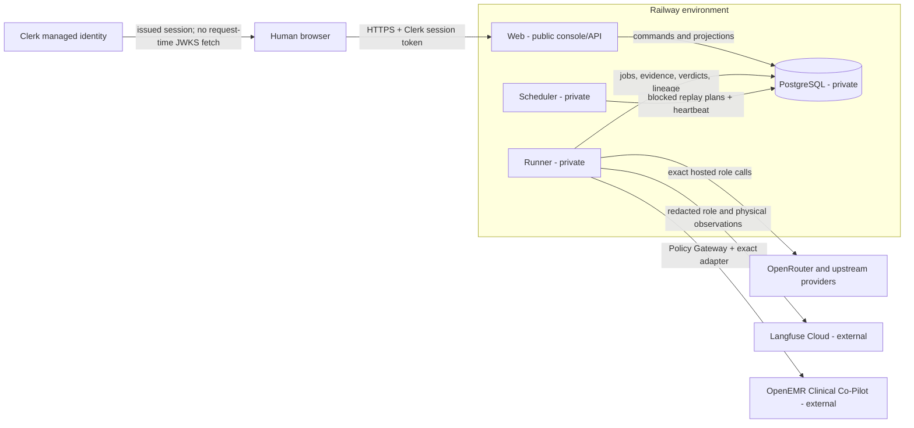

# Architecture and deployment evidence

## Reviewed architecture

Headshot is a multi-agent adversarial evaluation platform. The OpenEMR Clinical Co-Pilot is an
external target reached through a reviewed adapter; no target code lives in this repository. Four
agent roles are distinct from the trusted execution plane:

- **Orchestrator** reads verified PostgreSQL signals and selects bounded work.
- **Red Team** proposes adversarial inputs and cannot directly reach the target or authoritative
  evidence tables. In hosted mode its generated variant is quarantined; the only dispatched
  `AttackAttempt` remains the reviewed, hash-bound frozen seed until a new corpus is approved.
- **Judge** evaluates recorder-owned evidence with deterministic-oracle precedence.
- **Documentation** drafts structured reports from confirmed, sanitized evidence and has no
  publication authority.
- **Policy Gateway + Execution Recorder** is deterministic trusted code, not an agent. It alone
  releases a target-bound credential, enforces the authorization envelope, sends target traffic, and
  persists hash-addressed evidence.

The binding design is [`../../../ARCHITECTURE.md`](../../../ARCHITECTURE.md). This packet records the
implementation/deployment distinction that older prose does not always reflect.

Repository-owned exported architecture/trust diagrams are also retained as
[`../../diagrams/D2-D4-agent-interaction-trust.svg`](../../diagrams/D2-D4-agent-interaction-trust.svg)
with their
[`source`](../../diagrams/D2-D4-agent-interaction-trust.excalidraw) and
[`layout specification`](../../diagrams/D2-D4-agent-interaction-trust.spec.md).

## Deployment boundary

| Component | Intended ingress | Credential classes | Source status | Live status |
|---|---|---|---|---|
| Web | Public HTTPS; only service with a public domain | Clerk verification configuration and environment-local DB binding; no target/model secret | Implemented and packaged | Prior deployment observed; final commit not deployed |
| Runner | No public ingress | DB, model-provider references, Langfuse credentials, target credential reference/value at the dispatch boundary | Implemented and packaged | Prior service healthy; reviewed `0018` behavior not verified |
| Scheduler | No public ingress | DB only | Implemented and packaged | Prior service healthy; final release identity unavailable |
| PostgreSQL | Railway private network only | Database role credentials | Schema through `0018` in source | Deployed schema recorded at `0013` |
| Clerk | External managed identity | Browser session issuance; Web holds public JWT verification material | Backend verification implemented/tested | Full real-environment policy verification unavailable |
| Langfuse Cloud | Outbound from Runner only | Environment-specific public/secret keypair | Role/physical projection and query-back implemented/tested | Staging variables prepared, but no candidate deployment or query-back |
| Model provider | Outbound from Runner only | Provider credential reference, bounded by hosted configuration/run scope | Exact-route lifecycle implemented/tested | Final provider/model lineage not live-verified |
| Clinical Co-Pilot | Outbound from Policy Gateway only | Target-scoped reference resolved only by Runner | Adapter and gates implemented | Existing target is live; no new final-release campaign |

## Release topology requirements

The deployment configuration files are:

- [`../../../railway/web.json`](../../../railway/web.json) - Web plus the sole
  `alembic upgrade head` pre-deploy command;
- [`../../../railway/runner.json`](../../../railway/runner.json) - private Runner;
- [`../../../railway/scheduler.json`](../../../railway/scheduler.json) - private Scheduler; and
- [`../../../Dockerfile`](../../../Dockerfile) - one reviewed, non-root runtime image for all
  processes.

Staging and production must have separate databases, target authorization, provider/target secrets,
Clerk configuration, and Langfuse project/keypairs. An environment label inside a shared Langfuse
project is not isolation. Staging tracing/provider variables have been prepared without triggering a
deployment; production tracing/provider configuration has not been accepted and is intentionally
untouched until the production gates pass. No key or secret value is retained here.

## Exact hosted model boundary

The candidate's hosted configuration schema v2 binds the model, exact OpenRouter route, observed
upstream display identity, and correct completion-token parameter:

| Agent | Model | Exact route | Accepted upstream identity | Token parameter |
|---|---|---|---|---|
| Orchestrator | `anthropic/claude-opus-4.8` | `amazon-bedrock/eu-west-1` | Amazon Bedrock | `max_tokens` |
| Red Team | `qwen/qwen3.5-397b-a17b` | `atlas-cloud/fp8` | AtlasCloud | `max_tokens` |
| Judge | `google/gemini-2.5-pro` | `google-vertex/global` | Google / Google Vertex | `max_tokens` |
| Documentation | `openai/gpt-5.4` | `azure/eu` | Azure | `max_completion_tokens` |

Fallback is disabled and model/provider substitution fails closed
([`../../../src/agentforge/agents/hosted.py`](../../../src/agentforge/agents/hosted.py),
[`../../../src/agentforge/providers/openrouter.py`](../../../src/agentforge/providers/openrouter.py)).
Catalog viability was checked without inference, but that read-only check is not campaign or
deployment evidence.

## Observation hierarchy

Each durable role execution projects a Langfuse `AGENT`. Each physical hosted invocation projects
one `provider.openrouter.attempt` `GENERATION` beneath its owning role and carries the durable provider
invocation/event identities. Physical generations own token and cost fields. The logical
`agent.<role>.runtime` child is metadata-only for usage/cost, preventing double counting. Every
physical target request is separately tied to its owning Red Team/attempt identity. A non-raising SDK
flush remains `queued`; only exact remote query-back may mark the durable row `exported`.

This hierarchy is implemented/tested in candidate source and migration `0018`; it has not been
observed in staging or reconciled against PostgreSQL.

## Current deployment finding

The latest repository-grounded live review is
[`../../security/LANGFUSE_AGENT_OBSERVABILITY_REVIEW_2026-07-24.md`](../../security/LANGFUSE_AGENT_OBSERVABILITY_REVIEW_2026-07-24.md).
It records:

- staging and production release `23490ea`;
- deployed migration `0013`;
- zero `agent_executions`; and
- zero canonical agent/runtime observations in Langfuse.

The source baseline inspected for this packet has a single migration head at `0018`. Accordingly,
the current deployment proves an older release only. It cannot be used as evidence for the hosted
four-agent, physical provider-call, or Langfuse query-back implementation.

## Promotion gates

Staging promotion requires the exact final commit on both remotes, green authoritative GitHub CI,
one migration head,
Web-only public ingress, private Runner/Scheduler/PostgreSQL, `/health` and `/ready`, protected-route
denial, an authenticated acceptance flow, one exact authorized synthetic campaign, ordered durable
agent records, and successful Langfuse query-back.

Production promotion additionally requires an explicit human deploy grant and a recorded compatible
rollback deployment plus a confirmed database backup/restore recovery point. Application deployment
rollback history exists, but no production database backup/restore binding is confirmed. No
production promotion is authorized by this packet.
