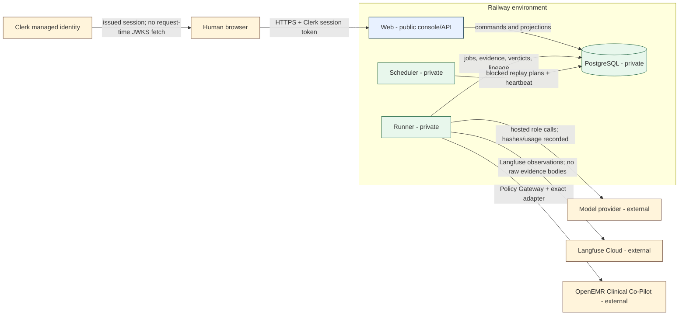

# Architecture and deployment evidence

## Reviewed architecture

Headshot is a multi-agent adversarial evaluation platform. The OpenEMR Clinical Co-Pilot is an
external target reached through a reviewed adapter; no target code lives in this repository. Four
agent roles are distinct from the trusted execution plane:

- **Orchestrator** reads verified PostgreSQL signals and selects bounded work.
- **Red Team** proposes adversarial inputs and cannot directly reach the target or authoritative
  evidence tables.
- **Judge** evaluates recorder-owned evidence with deterministic-oracle precedence.
- **Documentation** drafts structured reports from confirmed, sanitized evidence and has no
  publication authority.
- **Policy Gateway + Execution Recorder** is deterministic trusted code, not an agent. It alone
  releases a target-bound credential, enforces the authorization envelope, sends target traffic, and
  persists hash-addressed evidence.

The binding design is [`../../../ARCHITECTURE.md`](../../../ARCHITECTURE.md). This packet records the
implementation/deployment distinction that older prose does not always reflect.

## Deployment boundary

| Component | Intended ingress | Credential classes | Source status | Live status |
|---|---|---|---|---|
| Web | Public HTTPS; only service with a public domain | Clerk verification configuration and environment-local DB binding; no target/model secret | Implemented and packaged | Staging shell proved at `2069036e`; final commit not deployed |
| Runner | No public ingress | DB, model-provider references, Langfuse credentials, target credential reference/value at the dispatch boundary | Implemented and packaged | Staging deployment exists; final `0022` runtime not verified |
| Scheduler | No public ingress | DB only | Implemented and packaged | Staging deployment exists; final release identity pending |
| PostgreSQL | Railway private network only | Database role credentials | Preparation base through `0021`; release target `0022` pending | Staging `0021`; production `0013` |
| Clerk | External managed identity | Browser session issuance; Web holds public JWT verification material | Backend verification implemented/tested | Full real-environment policy verification pending |
| Langfuse Cloud | Outbound from Runner only | Environment-specific public/secret keypair | Projection and query-back implemented | No canonical observations for the deployed release |
| Model provider | Outbound from Runner only | Provider credential reference, bounded by hosted configuration/run scope | Hosted lifecycle implemented | Final provider/model lineage not live-verified |
| Clinical Co-Pilot | Outbound from Policy Gateway only | Target-scoped reference resolved only by Runner | Adapter and gates implemented | Existing target is live; no new final-release campaign |

## Release topology requirements

The deployment configuration files are:

- [`../../../railway/web.json`](../../../railway/web.json) - Web plus the sole
  `alembic upgrade head` pre-deploy command;
- [`../../../railway/runner.json`](../../../railway/runner.json) - private Runner;
- [`../../../railway/scheduler.json`](../../../railway/scheduler.json) - private Scheduler; and
- [`../../../Dockerfile`](../../../Dockerfile) - one reviewed, non-root runtime image for all
  processes.

Staging and production must have separate databases, target authorization, provider/target secrets,
Clerk configuration, and Langfuse project/keypairs. An environment label inside a shared Langfuse
project is not isolation.

## Current deployment finding

- Staging historically deployed exact candidate `2069036e` Runner-first, applied `0013 → 0021`,
  brought Web and Scheduler up, returned `200` for health/readiness, returned `401` for an
  unauthenticated protected route, and loaded the console/sign-in shell. The observed abbreviated
  image digests were Web `sha256:77f43ce5…bbdc`, Runner `sha256:8cb818…bcc9`, and Scheduler
  `sha256:98860d…e078`; only Web had a public route.
- No live campaign was run in that staging proof. It therefore proves deployment mechanics and the
  unauthenticated boundary, not hosted four-role execution, signed-in Clerk RBAC, final cost, or
  Langfuse query-back.
- Production remains the older `23490ea` / `0013` release. Its observed abbreviated image digests
  were Web `sha256:4bdfb1…551c7`, Runner `sha256:806d42…f55d`, and Scheduler
  `sha256:0983d5…60b67`; only Web had a public route.
- The packet preparation base has one source head at `0021`; the release target is the incoming
  serialized `0022`. Neither is represented as the final shipped release.

## Promotion gates

For each environment, promote only the exact final commit after green GitHub CI and exact GitLab
mirroring. Build and record one immutable image digest; quiesce application services; deploy the
private Runner first; apply and verify the single `0022` head; verify Runner health; then activate
Web and Scheduler. Web must return `200` for health/readiness, `401` for an unauthenticated protected
route, and a non-blank console shell. Runner, Scheduler, and PostgreSQL remain private.

Staging must prove this exact sequence before production. If Web renders a blank surface, roll back
Web only while Runner and data stay intact, investigate, and retry. This synthetic assignment does
not require a database-backup artifact; the safety controls are the clean staging migration,
additive serialized migrations, quiescence, and compatible image rollback.

Campaign acceptance is a separate runtime authorization boundary: distinct authenticated launcher
and approver principals authorize the exact synthetic operation, then ordered durable executions and
Langfuse query-back are retained. Deployment authority never substitutes for campaign authority.
