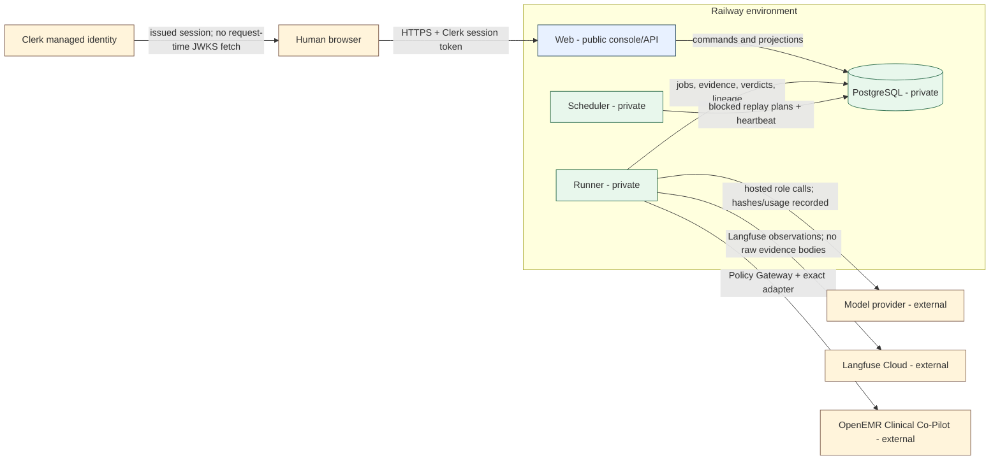

# Architecture and deployment evidence

## Reviewed architecture

Headshot is a multi-agent adversarial evaluation platform. The OpenEMR Clinical Co-Pilot is an
external target reached through a reviewed adapter; no target code lives in this repository. Four
agent roles are distinct from the trusted execution plane:

- **Orchestrator** reads verified PostgreSQL signals and selects bounded work.
- **Red Team** proposes adversarial inputs and cannot directly reach the target or authoritative
  evidence tables.
- **Judge** evaluates recorder-owned evidence with deterministic-oracle precedence.
- **Documentation** drafts structured reports from confirmed, sanitized evidence and has no
  publication authority.
- **Policy Gateway + Execution Recorder** is deterministic trusted code, not an agent. It alone
  releases a target-bound credential, enforces the authorization envelope, sends target traffic, and
  persists hash-addressed evidence.

The binding design is [`../../../ARCHITECTURE.md`](../../../ARCHITECTURE.md). This packet records the
implementation/deployment distinction that older prose does not always reflect.

## Deployment boundary

| Component | Intended ingress | Credential classes | Source status | Live status |
|---|---|---|---|---|
| Web | Public HTTPS; only service with a public domain | Clerk verification configuration and environment-local DB binding; no target/model secret | Implemented and packaged | Prior deployment observed; final commit not deployed |
| Runner | No public ingress | DB, model-provider references, Langfuse credentials, target credential reference/value at the dispatch boundary | Implemented and packaged | Prior service healthy; reviewed `0017` behavior not verified |
| Scheduler | No public ingress | DB only | Implemented and packaged | Prior service healthy; final release identity pending |
| PostgreSQL | Railway private network only | Database role credentials | Schema through `0017` in source | Deployed schema recorded at `0013` |
| Clerk | External managed identity | Browser session issuance; Web holds public JWT verification material | Backend verification implemented/tested | Full real-environment policy verification pending |
| Langfuse Cloud | Outbound from Runner only | Environment-specific public/secret keypair | Projection and query-back implemented | No canonical observations for the deployed release |
| Model provider | Outbound from Runner only | Provider credential reference, bounded by hosted configuration/run scope | Hosted lifecycle implemented | Final provider/model lineage not live-verified |
| Clinical Co-Pilot | Outbound from Policy Gateway only | Target-scoped reference resolved only by Runner | Adapter and gates implemented | Existing target is live; no new final-release campaign |

## Release topology requirements

The deployment configuration files are:

- [`../../../railway/web.json`](../../../railway/web.json) - Web plus the sole
  `alembic upgrade head` pre-deploy command;
- [`../../../railway/runner.json`](../../../railway/runner.json) - private Runner;
- [`../../../railway/scheduler.json`](../../../railway/scheduler.json) - private Scheduler; and
- [`../../../Dockerfile`](../../../Dockerfile) - one reviewed, non-root runtime image for all
  processes.

Staging and production must have separate databases, target authorization, provider/target secrets,
Clerk configuration, and Langfuse project/keypairs. An environment label inside a shared Langfuse
project is not isolation.

## Current deployment finding

The latest repository-grounded live review is
[`../../security/LANGFUSE_AGENT_OBSERVABILITY_REVIEW_2026-07-24.md`](../../security/LANGFUSE_AGENT_OBSERVABILITY_REVIEW_2026-07-24.md).
It records:

- staging and production release `23490ea`;
- deployed migration `0013`;
- zero `agent_executions`; and
- zero canonical agent/runtime observations in Langfuse.

The source baseline inspected for this packet has a single migration head at `0017`. Accordingly,
the current deployment proves an older release only. It cannot be used as evidence for the hosted
four-agent or Langfuse query-back implementation.

## Promotion gates

Staging promotion requires the exact final commit, green authoritative GitHub CI, one migration head,
Web-only public ingress, private Runner/Scheduler/PostgreSQL, `/health` and `/ready`, protected-route
denial, an authenticated acceptance flow, one exact authorized synthetic campaign, ordered durable
agent records, and successful Langfuse query-back.

Production promotion additionally requires an explicit human deploy grant and a recorded compatible
rollback deployment plus database recovery point. No production promotion is authorized by this
packet.
