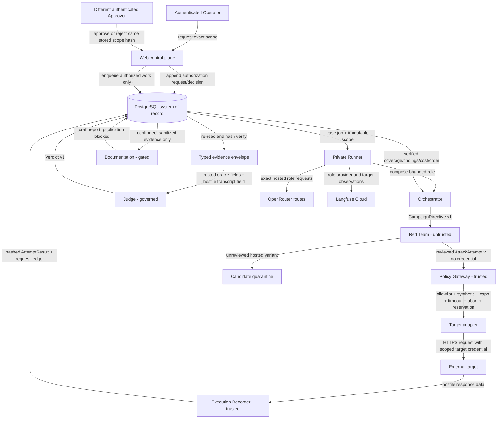

# Data flows and trust boundaries

## Campaign data flow

In hosted mode, the candidate Runner records one traced Red Team generation for each selected,
hash-bound seed, then quarantines/discards the unreviewed generated variant. The gateway dispatch
remains the byte-exact reviewed seed. Provider/trace/budget failure aborts instead of silently falling
back. A generated variant can become executable only through a new reviewed corpus hash and a new
authorization. This source behavior is tested but not live-verified.

## Trust zones

| Zone | Components/data | Allowed authority | Explicitly prohibited |
|---|---|---|---|
| Human identity | Browser, Clerk session, immutable Principal | Request operations carrying verified custom permissions | Supplying organization, role, permission, target, or approval authority as client-controlled truth |
| Trusted control plane | Web command handlers, Orchestrator policy, Policy Gateway, Execution Recorder | Bind exact scope, enforce policy, release scoped target credential, persist evidence | Treat authentication alone as campaign authorization; accept optimistic UI state as fact |
| Untrusted generation | Red Team output and all attack content | Propose typed attempts within the authorized corpus/policy | Hold target credentials, send target traffic directly, write authoritative evidence, judge itself |
| Governed evaluation | Judge, Documentation, regression admission | Evaluate typed evidence; draft or admit only under deterministic gates | Override a conclusive oracle, execute target actions, publish critical findings, remediate, or treat an identity-drifted model result as decisive |
| Authoritative storage | PostgreSQL rows, hashes, FKs, audit cursors, queue leases | Source of truth for campaign state, evidence, findings, cost, and lineage | Infer missing rows from UI state or Langfuse |
| External observation | Langfuse Cloud | Observe safe metadata, hashes, usage, cost, order, and timing | Become evidence or authorization authority; receive credentials/raw clinical bodies; own token/cost twice |
| External target/provider | Clinical Co-Pilot and exact model-provider routes | Return responses for exact authorized requests | Expand scope, substitute an unapproved route/model, or become trusted evidence without recorder verification |

## Data classification and handling

| Data class | Examples | Storage/export rule |
|---|---|---|
| Synthetic clinical fixture | Fabricated patient/context records and canaries | Allowed in the target/evidence path; must carry synthetic provenance and `contains_real_phi=false` |
| Hostile adversarial content | Attack turns and target response text | Quarantined as hostile evidence; size bounded; not exported to Langfuse; sanitized before Documentation |
| Credential material | Clerk bearer token, target session value, provider/Langfuse secret key | Runtime-only at its owning boundary; never committed, logged, traced, or stored in evidence |
| Credential reference | `secretref://` handle or a digest binding | May appear only where required for immutable scope; no secret value is embedded |
| Integrity metadata | Content hash, prompt/policy/configuration hashes, request ID | Persisted and safe to export where it reveals no secret/body |
| Human attribution | Minimal user/session/organization identifiers | Persisted for audit and separation of duties; raw claims/token are not retained |
| Usage/accounting | Input/output/reasoning tokens, retries, latency, provider-reported cost | Persisted when actually supplied; missing values remain unavailable, never zero-filled |

## Authoritative lineage

The durable join keys are Organization ID, campaign/run ID, attempt ID, agent execution ID and parent
execution ID, finding ID, target/surface/version, content hash, and provider request ID when a provider
returns one. Migration `0017` adds configuration, role-policy, model/provider, token, retry, Judge
calibration, oracle agreement, and decision-authority fields to the logical agent execution ledger.
Migration `0018` adds append-only physical provider invocation/event records, exact configured and
observed endpoint identity, physical sequence, status, latency, token/reasoning fields, retries/errors,
and measured cost.

Langfuse delivery is not considered complete when the SDK merely flushes. Migration `0016` requires
an exact remote query-back before a durable row may be marked `exported`; until then it remains
`queued`, `disabled`, or `error`. PostgreSQL remains authoritative if Langfuse is unavailable.

For hosted work, each role AGENT owns one
`provider.openrouter.attempt` GENERATION per physical invocation. The physical generation owns tokens
and cost; the logical `agent.<role>.runtime` child carries identity/status metadata only. This
prevents one provider call from appearing twice in cost totals. Query-back must reconcile the durable
provider invocation/event IDs as well as the logical role hierarchy.

## Data model and quality controls

| Domain | Principal records | Quality/access controls |
|---|---|---|
| Target catalog | Target/surface identity, immutable versions, lifecycle events | Server-owned catalog, exact version references, relative-path and allowlist validation |
| Human control plane | Authorization requests/decisions, command idempotency, audit events | Organization scope, immutable launcher/approver, scope hash, expiry, distinct-person trigger |
| Campaign/queue | Campaign runs/events/attempts, jobs, physical work-unit reservations | Versioned payloads, unique idempotency keys, bounded leases, dead-letter state, immutable physical coordinates |
| Evidence/evaluation | Attack cases, AttemptResult, Verdict, finding-evidence links | Required fields, content hashes, replay uniqueness, FKs, provenance, deterministic precedence |
| Reporting/regression | Findings, finding decisions, draft reports, dispositions, replay plans/results, case versions | Unique IDs, append-only draft evidence, confirmation/reproduction/right-reason gates, human publication block |
| Agent/hosted lineage | Agent configuration versions, hosted configuration sets, logical executions, physical provider invocations/events | Exactly four roles, append-only configuration, constrained lifecycle, exact route/model/token parameter, complete terminal provider/accounting tuple |
| Observability | Outbound request ledger, physical generation hierarchy, runtime status, Langfuse delivery/verification fields | Pre-send row, one-way terminal update, physical usage/cost ownership, safe hashes/metadata only, exact query-back before exported |

Common query indexes include finding severity, category, target version, Organization/state; campaign
run/attempt; queue depth/claim order; unobserved work reservations; agent role/status/start time; and
provider request identity. Concrete final regression/query SLO evidence remains unavailable.

## Judge authority at the evaluation boundary

Deterministic oracle/canary fields are code-owned and decisive. The model Judge can add an advisory
assessment only when it cannot contradict a conclusive oracle. Although the security owner produced a
passing calibration artifact, its configured identities do not exactly match this candidate's
`google-vertex/global` Judge route and `atlas-cloud/fp8` Red Team route, and its human/runtime
enablement flags are false. The release therefore keeps model-only dispositions fail-closed/advisory;
the campaign does not wait for model calibration because deterministic oracles remain the authority.

## Boundary verification still unavailable

A final deployed trace must demonstrate the exact ordered agent chain, one-to-one physical requests,
provider/model identity, attempts/retries, evidence hashes, finding/report behavior, and Langfuse
observations for one authorized campaign bound to the security owner's frozen corpus and Judge
identity. No frozen 100-case corpus/evidence is integrated yet. Historical manifests that predate the
durable `0016`–`0018` ledger cannot be backfilled and are not accepted as that proof.
