# Final-target adapter remediation

[locked-decision] `Week_3_AgentForge.pdf` remains authoritative. This plan covers only the two owner-authorized Clinical Co-Pilot targets, their surface adapters, multi-surface scan fanout, environment catalogs, and bounded deployment proof.

## Integration baseline

[locked-decision] T-F16 work starts from dual-remote integration commit `1ac3ee02be7855b638dd1fa43bb0612a3db5f025`, which includes partial adapter/catalog commit `54b3a4d30b52f85acdbf3098d5c7422e9fa841ce`. That partial code added path-derived evidence/document profiles to `OpenEmrAdapter`, dynamic document path substitution, fixture callbacks, mixed payload-profile sets, Runner heuristics, surface tests, and separate Staging/production catalog files.

[locked-decision] Those additions are an unreviewed repair baseline, not finished functionality. T-F16 Test Agents write new failing security/behavior tests against `1ac3ee0`; implementation tickets harden, extract, or delete the partial behavior. They do not create a second parallel adapter stack or claim pre-existing code as new TDD work.

## Current truth

| target | surface | owner contract | `1ac3ee0` state | required result |
|---|---|---|---|---|
| Week 1 | chat | `POST /chat`; JSON key `session_id` | supported | preserve |
| Week 1 | UI | `GET /app`; query key `sid` | disabled; no exact UI profile | hardened HTTP-only probe |
| Week 1 | evidence | anonymous `POST /evidence/search` | partial path-derived profile; disabled | no-auth typed adapter |
| Week 2 | chat | `POST /chat`; JSON key `session_id` | supported | preserve |
| Week 2 | UI | `GET /week2`; query key `sid` | disabled; no exact UI profile | hardened HTTP-only probe |
| Week 2 | evidence | anonymous `POST /evidence/search` | partial path-derived profile; disabled | no-auth typed adapter |
| Week 2 | documents | multipart/GET workflow; key `session_id` | partial upload/read profiles; no bounded workflow | gateway-owned state machine |

[locked-decision] The remote catalogs correctly began separating Staging and production, but still carry version `1.0.0`, duplicate logical aliases, target-wide profile sets, and disabled non-chat surfaces. The legacy `config/targets/clinical-copilot-20260724.json` is staging-bound and cannot serve production.

## Sanitized contracts

[locked-decision] Agents use this summary and repository tests. They never open owner environment files, copy a session, read owner PDF fixture bytes, or persist a credential-bearing URL.

### Exact credential placement

| operation | credential rule |
|---|---|
| chat | JSON field named exactly `session_id` |
| UI `/app` and `/week2` | query field named exactly `sid` |
| evidence search | none; no secret resolution |
| document upload | multipart field named exactly `session_id` |
| document status/report/preview/readback | query field named exactly `session_id` |

[locked-decision] Every operation policy binds both placement and exact field name into its canonical hash. Alternate query/header/cookie/body placement is rejected and cannot appear in telemetry, metadata, errors, screenshots, or reports.

### Evidence search

- [locked-decision] One anonymous JSON `POST /evidence/search` with only bounded `query` and integer `k` in `1..10`.
- [locked-decision] HTTP 200 JSON has exact `corpus_version`, `items`, and `correlation_id`; at most ten typed snippets; source/corpus content IDs; scores in `[0,1]`; matching response-header correlation.

### UI shell availability

- [locked-decision] Week 1 probes only `/app`; Week 2 only `/week2`.
- [locked-decision] The scoped session is revealed as `sid` only at final transport serialization.
- [locked-decision] The adapter has no browser, DOM, script, redirect, subresource, screenshot, or navigation capability. It retains only redacted route, status, media type, byte count, optional correlation, and content hash.

### Week 2 private fixtures

| opaque reference | SHA-256 | bytes | media type | fixed document type | workflow |
|---|---|---:|---|---|---|
| `fixture://clinical-copilot/week2/clean-pdf-20260724` | `145f3d50a1f807429d5b0ddc459bf649c00a5b8f64736982132fab14a7574969` | 753 | `application/pdf` | `lab_pdf` | `lab-extraction-v1` |
| `fixture://clinical-copilot/week2/intake-full-valid-pdf-20260724` | `406c8eb63e0675b6ffa2c04d5bde687de14eff997be3bac6960fb3c3753c45bd` | 2146 | `application/pdf` | `intake_form` | `intake-idempotency-v1` |

[locked-decision] The entire descriptor—not merely the opaque ref—is part of the surface policy and authorization hash. Runtime resolution accepts only a Runner-only, no-follow, regular-file binding matching every descriptor field.

## Retry-inclusive physical limits

[locked-decision] `operation_count` and `physical_request_limit` are distinct. The canonical policy binds a retry count for every operation class, and preflight reserves the sum of all possible physical attempts before a state-changing upload.

| workflow class | logical operations | retries per operation | physical maximum |
|---|---:|---:|---:|
| lab upload | 1 | 0 | 1 |
| lab status poll | up to 30 | 1 | 60 |
| lab report/preview/readback | 3 | 1 | 6 |
| **lab total** | **34** | mixed | **67** |
| intake upload + duplicate check | 2 | 0 | 2 |

[locked-decision] Upload retries are zero because an ambiguous timeout cannot prove whether a state change occurred. Target-side duplicate behavior is verification evidence, not permission to retry an unknown upload automatically. Poll/read retries are at most one, consume rate/cost/attempt/trace capacity, and occur only for authorization-listed typed transient failures.

[locked-decision] Generic gateway tests still include a policy that permits two retries and a fail-twice/succeed-third path, proving retry-inclusive arithmetic. Document tests prove a second poll/read failure does not produce a third attempt, the full 30-poll lab path fits 67, and capacity below 67 refuses before upload with zero calls.

## Gateway-owned operation architecture

```mermaid
flowchart LR
    U["User scan launch"] --> S["Versioned ScanPlan"]
    S --> C["Child scope per target/surface"]
    C --> P["Canonical surface policy<br/>profile + field + retries + fixture descriptor"]
    P --> A["Pure adapter state machine"]
    A --> G["Policy Gateway one-operation sender"]
    G --> V["Recheck scope, lease, abort,<br/>host/path, physical capacity"]
    V --> H["One HTTPS request"]
    H --> M["Charge + trace + immutable count"]
    M --> A
    M --> O["Sanitized child outcome"]
    O --> R["Scan aggregate"]
```

[locked-decision] The adapter state machine cannot own an HTTP client. The gateway proves full retry-inclusive attempt/cost/rate-window/authorization-time/trace capacity before the first write, then revalidates and charges every physical request and retry.

[locked-decision] Dynamic document IDs are hostile response data. They may fill only a single closed path segment in pre-authorized templates on the original exact host.

## Immutable environment catalogs

[locked-decision] T-F16e replaces the partial catalog artifacts rather than mutating version `1.0.0` definitions in place. Only the canonical IDs `clinical-copilot-week1` and `clinical-copilot-week2` survive; partial `copilot-*` aliases are rejected.

[locked-decision] The breaking authorization/policy change uses target and surface version `2.0.0` for the non-document deployment state. Old `1.0.0` snapshots and approvals remain immutable rollback/history and cannot authorize `2.0.0`.

[locked-decision] Staging and production have distinct secret-free catalog artifacts and hashes. Each binds its own environment, credential reference, ownership/promotion authorization, policy hashes, and fixture-binding reference. Web and Runner must match within one environment; Staging and production must not be asserted byte-identical.

[locked-decision] Version `2.0.0` enables chat/evidence/UI and keeps the document surface disabled. If and only if T-F16g validates a fresh trusted attestation produced after the deployed Runner actually performs the zero-target-call fixture check, T-F16h may stage a separately hashed `2.1.0` target/surface set, append the authorized document-enable state event while the target is draft, then transition it through validating to ready. Failure leaves the active `2.0.0` chat/evidence/UI state unchanged.

[locked-decision] Catalog synchronization is idempotent per environment, target version, surface version, and canonical input hash. Activation and rollback are append-only state/lifecycle events; repeated requests return the original result, and changed input conflicts without mutation.

## Multi-surface scan semantics

[locked-decision] T-F16f extends the real control-plane/API/store/queue path; Runner-only fanout is forbidden. One API authorization request durably stores the versioned parent ScanPlan and the fixed eight-child declared scope: Week 1 chat/evidence/UI; Week 2 chat/evidence/UI/lab/intake. The parent and every child have canonical hashes and separate approval records. A distinct approver must approve every exact child before the persisted launch transaction can create the run and enqueue its content-addressed plan. Same-key retries return the original request/decision/run; changed input conflicts. Recovery reloads the persisted plan and decisions rather than trusting queue payload authority.

[locked-decision] The queue payload contains only parent request/decision/run/plan hashes and child decision/scope hashes. It is not authorization. Runner reloads all immutable records, verifies every child was separately approved and is still current, and refuses the entire fanout before dispatch on any missing, changed, expired, rejected, or self-approved record. A cross-target launch never shares a child scope, credential resolver, session lease, gateway, counter, or adapter.

[locked-decision] Before any child dispatch, orchestration verifies every child scope/policy hash and reserves the aggregate of all retry-inclusive child maxima under the parent cap. Anonymous children cannot access credential resolution. Each authenticated child remains pinned to its target's original session generation.

[locked-decision] Authorization/hash/lease/cap/abort/integrity failure hard-aborts the parent and prevents later children. A typed target/application failure terminates only that child and may continue to already-authorized independent children; the final scan is `partial`, never `complete`. Document writes run last within Week 2.

[locked-decision] The aggregate always reports all eight declared child states and exact logical/physical counts. The result contract does not expose `full_surface_scan`. It exposes `declared_scope_complete`, which is true only when all eight declared children reach their success contracts, and `active_surface_scan_complete`, which may be true when every active child succeeds. Under v2.0, failed fixture proof, or partial v2.1 activation, lab/intake remain explicit `inactive_fixture_unproved` children, `declared_scope_complete=false`, and no result may imply a full scan.

## TDD tickets and waves

| wave | ticket | purpose |
|---:|---|---|
| 17 | T-F16a | harden partial policy/spec/catalog authorization contract |
| 18 | T-F16b | gateway-owned retry-inclusive physical operation accounting |
| 19 | T-F16c, T-F16d | replace partial UI/evidence profiles; build document state machine |
| 20 | T-F16e | immutable environment-specific catalog migration and per-surface Runner composition |
| 21 | T-F16f | durable API authorization/approval/launch plus multi-surface fanout and aggregate |
| 22 | T-F16g | signed current-state attestation, observer, deployment grant, and networkless verifier |
| 23 | T-F16h | authorized Staging/production rollout, bounded proof, review, rollback |

[locked-decision] Every deterministic ticket follows reviewed RED -> freeze -> GREEN (maximum three attempts) -> coordinator gate rerun -> independent Code/Security review. T-F16h has distinct Executor, Evidence Reviewer, and Security Reviewer. Runtime role model locks remain unchanged.

## Deployment and rollback

1. [locked-decision] Merge/harden against `1ac3ee0`; retain TDD diff provenance.
2. [locked-decision] The executable bootstrap is exact `python3`. The preflight records and verifies the resolved interpreter realpath/version, executable digest, script digest, release SHA, and dependency-lock digest against the grant; unsupported or drifted bootstrap exits 4.
3. [locked-decision] Before the first mutation, and after every deployment/catalog transition, run T-F16g's exact read-only observer to emit a canonical signed `FinalTargetCurrentStateAttestation`. A distinct authorized approver then supplies the immutable transition-grant version binding that exact attestation hash. Run the exact `python3 ... --check-only` verifier before the next action. T-F16h never creates or edits a grant; missing transition authority is `BLOCKED`. Failure produces exit 4 and zero next mutation, resolution, target socket, or spend.
4. [locked-decision] The attestation binds trusted issuer/key fingerprint, environment/project/service IDs, `observed_at`, expiry and grant-bounded maximum age, monotonic Runner/Web deployment IDs, raw provider-response digests, topology, and hashes of release/deployment/catalog/session/fixture/scan/rollback inputs. The grant binds the issuer/key and attestation hash. A stale, unsigned, wrong-environment, rollbacked, replayed, or caller-fabricated state cannot pass.
5. [locked-decision] Deploy Staging Runner; refresh/verify attestation; prove migrations/catalog/session readiness; run an actual Runner-local, zero-target-call fixture open/no-follow/hash/length/media/type/workflow check; include its signed result in a refreshed attestation; verify again; then deploy Staging Web and refresh/verify within-environment parity.
6. [locked-decision] Activate `2.0.0`, refresh/verify, and activate document-capable `2.1.0` only after the post-deploy fixture proof while draft. Refresh/verify before the bounded scan. Any later step uses a newly observed attestation; reusing the previous observation is forbidden.
7. [locked-decision] Launch through the real T-F16f API authorization/approval/queue path and run one sequential bounded scan. `declared_scope_complete=true` is required for full-target evidence; otherwise evidence is explicitly incomplete. Then run sanitized Bruno as independent target oracle. No screenshots or response bodies.
8. [locked-decision] Independent reviewers recompute release/catalog/policy/fixture/grant/attestation/count/trace hashes.
9. [locked-decision] Promote the identical release under a production-specific grant; repeat observation, Runner-before-Web, post-deploy fixture proof, environment-specific catalog checks, and preflight after every transition.
10. [locked-decision] Any gate, freshness, signature, redaction, count, session, fixture, health, or response mismatch appends rollback events and restores the prior catalog/release. Refresh and verify the post-rollback attestation; partial sanitized evidence remains.

## Open authority decisions

- [open-question] Supply the signed T-F16g deployment grant with current release, exact environment/service IDs, both catalog/activation hashes, session generations, fixture descriptors/bindings, retry-inclusive caps, principals, expiry, rollback, production scope, trusted observer issuer/key fingerprint, attestation maximum age, and exact interpreter/bootstrap provenance.
- [open-question] Provision the trusted read-only state observer/signing identity; an unsigned caller-written manifest is never current-state evidence.
- [open-question] Provision or identify the approved Runner-only private binding for the two fixture refs. The extracted bundle is never committed or assumed uploadable.
- [open-question] Confirm distinct production promotion authority; absent it, T-F16h completes Staging and records production blocked.
- [scope-cut] Adapter/scan smoke is not the separately authorized 100-case load/performance campaign.
